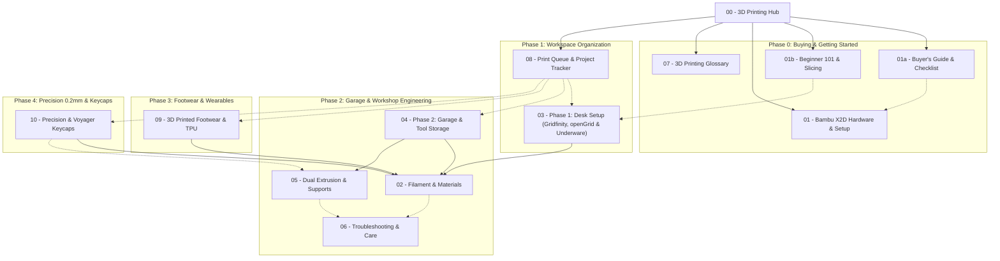

# 🚀 3D Printing Journey & Bambu X2D Hub

Welcome to your personal 3D printing command center, built around acquiring, mastering, and running the **Bambu X2D**. 

This vault serves as your complete end-to-end knowledge base:
1. **Pre-Purchase & Evaluation:** Budgeting, workspace planning, and buying checklists.
2. **Beginner Onboarding:** Slicing fundamentals, software workflows, and Day 1 setup.
3. **Unified Room-Scale Infrastructure:** Universal **3/4" Birch French Cleats** (3" slats, 3.5" clear gaps, 6.5" center-to-center) across both **Office** and **Garage**.
4. **Three-Tier Workspace Stack:** French Cleats (Macro), **openGrid Islands** (Meso), and **Gridfinity & Underware** (Micro).
5. **Garage Functional Engineering:** Heavy-duty **Milwaukee FUEL M18 & M12 cordless tool & battery docks** using engineering filaments (**ASA**, **EZ PA / Nylon**, **PC-ABS**) and dual-nozzle zero-gap supports.
6. **Footwear & Wearables:** Single-piece Croc-style clogs, slides, barefoot shoes, and running shoe lattice midsoles using flexible polymers (**TPU 95A** & **Foaming TPU**).
7. **Precision 0.2mm Printing:** Ultra-fine mechanical keyboard keycaps for the **ZSA Voyager** (Kailh Choc v1 switches, *KLP Lamé* & *Chicago Steno* profiles, flush dual-color legends).
8. **Active Note-Taking:** Reusable templates for logging projects, tracking filament spools, and prioritizing your print queue.

---

## 🗺️ Knowledge Base Navigation (Map of Content)

---

## 📚 Master Index

| Section | Note | Focus Area | Key Highlights |
| :--- | :--- | :--- | :--- |
| **README** | [[README]] | Git Repository Hub | Visual architecture, repo manifest, Git LFS, and Obsidian usage |
| **00** | [[00 - 3D Printing Hub]] | Central Dashboard | Map of Content, roadmap, and quick rules |
| **01a**| [[01a - Bambu X2D Buyer's Guide & Purchase Checklist]] | Purchase planning | Standalone vs Combo (AMS 2 Pro), TCO budget, space & power requirements, Day 1 cart |
| **01b**| [[01b - Beginner 101 & Slicer Fundamentals]] | Core concepts & setup | Model sources, slicer settings (walls vs infill, Gyroid, supports), unboxing & calibration |
| **01** | [[01 - Bambu X2D Hardware & Setup]] | Machine capabilities | Dual independent nozzles, actively heated chamber, plate selection, ventilation |
| **02** | [[02 - Filament & Material Selection]] | Material strategy | PLA vs PETG vs Engineering (ASA, EZ PA Nylon, PC-ABS), drying parameters |
| **03** | [[03 - Phase 1 - Desk Organization (Gridfinity & openGrid)]] | Three-Tier Workspace Stack | Universal French Cleats (Macro), openGrid Islands (Meso), Gridfinity & Underware (Micro) |
| **04** | [[04 - Phase 2 - Garage & Workshop Tool Organization]] | Garage & shop engineering | 4x8 Birch French cleat cut plan, 3.5" spacing, Milwaukee FUEL M18/M12 tool & battery docks |
| **05** | [[05 - X2D Dual Extrusion & Support Workflow]] | Multi-material support | Zero-gap interface printing (`Support for ABS`), slicer configuration |
| **06** | [[06 - Print Troubleshooting & Maintenance]] | Reliability & repairs | Moisture fixes, warping prevention, Dawn dish soap cleaning, routine maintenance |
| **07** | [[07 - 3D Printing Glossary & Reference]] | Terminology dictionary | CoreXY, Pressure Advance, Glass Transition ($T_g$), HDT, Stringing, Creep |
| **08** | [[08 - Print Queue & Project Tracker]] | Active project backlog | Kanban status, printer upgrades, desk prints, garage builds, footwear queue |
| **09** | [[09 - 3D Printed Footwear (Sneakers, Clogs & TPU)]] | Wearables & shoes | Single-piece clogs, barefoot shoes, running shoe lattice midsoles, Foaming TPU |
| **10** | [[10 - Precision Printing & ZSA Voyager Keycaps (0.2mm Nozzle)]] | Precision 0.2mm printing | ZSA Voyager, Kailh Choc v1 switches, KLP Lamé & CS profiles, flush dual-color legends |

---

## 📝 Active Note-Taking Templates & Tracking

When managing your 3D printing workflow, use the pre-built templates in `Templates/`:

* **Log a New Print Project:** Use `Templates/Template - Print Project Log.md` to document slicer parameters, run times, failure post-mortems, and finished photos. See example: [[Starter Project - Bambu Scraper & Poop Chute Bin]].
* **Track a Filament Spool:** Use `Templates/Template - Filament Spool Tracker.md` to log remaining spool weights, calibrated temperature/flow profiles, and drying history.
* **Capture Print Ideas:** Use `Templates/Template - Model Evaluation & Idea.md` to save models found on MakerWorld or Printables for future printing.

---

## 🎯 The Three-Phase Roadmap

### 🏁 Phase 0: Evaluation & Machine Setup
* **Goal:** Finalize purchase, prepare workbench space, power, and ventilation, run initial calibration.
* **Key Milestones:**
  - [ ] Finalize standalone vs. AMS 2 Pro combo decision ([[01a - Bambu X2D Buyer's Guide & Purchase Checklist]]).
  - [ ] Order machine, essential build plates, basic tools, and starter filament.
  - [ ] Prepare a vibration-resistant workbench with 15A power and poop chute clearance.
  - [ ] Unbox, remove transit screws, run auto-calibration, and print first 3DBenchy.
  - [ ] Print Day 1 essentials: [[Starter Project - Bambu Scraper & Poop Chute Bin]].

### 📦 Phase 1: Workspace Organization & The Three-Tier Stack
* **Goal:** Establish universal room-scale French cleat infrastructure indoors, mount rigid openGrid islands, and organize desk drawers and cables.
* **Systems:**
  1. **Level 1 (Macro):** [[03 - Phase 1 - Desk Organization (Gridfinity & openGrid)#The Unified Three-Tier Hierarchy|Universal 3/4" French Cleats]] (3" slats, 3.5" gaps, 6.5" center-to-center across Office & Garage).
  2. **Level 2 (Meso):** [[03 - Phase 1 - Desk Organization (Gridfinity & openGrid)#Level 2 openGrid Islands for French Cleats|openGrid Islands]] (28mm modular grid, Multiconnect snaps, dual-cleat 168mm brackets, 3/4" plumb spacers).
  3. **Level 3 (Micro):** [[03 - Phase 1 - Desk Organization (Gridfinity & openGrid)#Level 3 Gridfinity Drawers & Desktop Trays|Gridfinity]] (drawers) & [[03 - Phase 1 - Desk Organization (Gridfinity & openGrid)#Level 3 Underware for openGrid Under-Desk Cable Management|Underware for openGrid]] (under-desk cables & gear).
* **Filaments:** **PLA / PLA+** (rigid Gridfinity bins) & **PETG** (openGrid tiles, Multiconnect clips, and Underware raceways).

### 🛠️ Phase 2: Workshop & Garage Organization (Functional Engineering)
* **Goal:** Create load-bearing, impact-resistant, heat- and UV-tolerant tool holders and mounts.
* **Systems:** **3/4" Birch French Cleat System** (4x8 cut plan yielding 16 cleats, 3.5" story stick spacing) & **Milwaukee FUEL M18/M12 Tool & Battery Storage** (drill docks, circular saw shoe bracket, grinder neck collar, Sawzall horizontal cradle, locking battery rails, dual rapid charger mount).
* **Filaments:** Engineering plastics — **ASA** (UV & heat), **EZ PA / Nylon** (high toughness & wear), and **PC-ABS** (rigid high-load brackets).
* **Key Milestones:**
  - [ ] Rip 4x8 Birch sheet into 8 strips @ 5.85" wide; split at 45° center bevel (128 linear feet of cleats).
  - [ ] Mount wall rails using 3.5" story-stick spacer block and 2x Spax cabinet screws per 16" stud ([[Garage - Modular French Cleat Tool System]]).
  - [ ] Print universal 45° cleat backplates in **ASA** with side-print orientation to prevent 45° shear delamination.
  - [ ] Print Milwaukee M18 Drill/Driver slide docks, M12 circular saw shoe cradle, and grinder neck mount ([[Garage - Milwaukee M18 & M12 Tool & Battery Storage]]).
  - [ ] Print M18 4-bay battery strip with **EZ PA Nylon** spring retention tabs and M12 cylindrical honeycomb caddy.
  - [ ] Configure dual-nozzle zero-gap interface supports using `Support for ABS` ([[05 - X2D Dual Extrusion & Support Workflow]]).

### 👟 Phase 3: Footwear & Wearables (Flexible Polymers)
* **Goal:** Master printing ergonomic, custom-molded footwear using direct-drive flexible filaments.
* **Projects:** Single-piece Croc-style clogs, casual slides, barefoot walking shoes, and running sneaker lattice midsoles.
* **Filaments:** **TPU 95A** (firm, high-wear tread) & **Foaming TPU / varioShore** (expanded EVA-style cushioning foam).
* **Key Milestones:**
  - [ ] Measure exact foot length in millimeters and calculate scale percentage ([[09 - 3D Printed Footwear (Sneakers, Clogs & TPU)#Sizing Fit Build Plate Orientation|Sizing Guide]]).
  - [ ] Set up external direct-feed spool path with 4-in-1 PTFE adapter and low-drag 608 roller / dry box (bypassing AMS).
  - [ ] Apply glue stick or liquid glue release barrier to Textured PEI plate.
  - [ ] Print first pair of single-piece slip-on clogs ([[Footwear - Parametric Croc-Style Clogs]]).
  - [ ] Experiment with dual-extrusion dual-density footwear on the X2D (TPU 95A outsole + Foaming TPU midsole).

### ⌨️ Phase 4: Precision 0.2mm Printing (ZSA Voyager Keycaps)
* **Goal:** Produce ultra-detailed, durable low-profile keycaps for the ZSA Voyager keyboard.
* **Hardware:** **0.2 mm Hardened Steel Nozzle** (resolves 0.55mm Kailh Choc v1 stem prongs).
* **Projects:** Custom *KLP Lamé* or *Chicago Steno* ergonomic keycap sets, tactile homing ridges, angled thumb cluster fans.
* **Filaments:** **PETG-HF** (tough, flexible stem retention) or **ASA** (matte PBT-style feel, zero oil shine).
* **Key Milestones:**
  - [ ] Swap to 0.2 mm Hardened Steel hotend and select profile in printer touchscreen.
  - [ ] Print single 1U test cap to dial in Kailh Choc v1 stem tolerance ([[Keycaps - ZSA Voyager Ergonomic Choc Set]]).
  - [ ] Enable **Print by Object** (sequential printing) to eliminate travel stringing across multi-key batches.
  - [ ] Configure micro **Fuzzy Skin** (`0.06mm / 0.10mm`) for injection-molded matte texture.
  - [ ] Print 52-key custom set with flush dual-color legends using X2D dual nozzles.

---

## ⚡ Quick Rules of Thumb

> [!TIP] Workspace Organization System Guide
> * **Inside Drawers & On Top of Desks:** Use **Gridfinity** (42mm grid, magnetic).
> * **On Walls & Desktop Focal Zones:** Use **openGrid** (28mm grid, lightweight lattice, Multiconnect snaps).
> * **Under Desks & Behind Furniture:** Use **Underware for openGrid** (cable raceways, power supply brackets).

> [!IMPORTANT] Slicing Golden Rules
> * **Walls beat infill:** Adding 2 extra walls increases structural strength far more than jumping from 20% to 60% infill.
> * **Avoid Grid infill:** Use **Gyroid** or **Adaptive Cubic** to prevent the nozzle from colliding with intersecting infill lines.
> * **Dual-nozzle zero-gap:** Use the Auxiliary nozzle with `Support for ABS` touching ASA or Nylon at `0.0 mm` Z-distance for glass-smooth breakaway overhangs.
