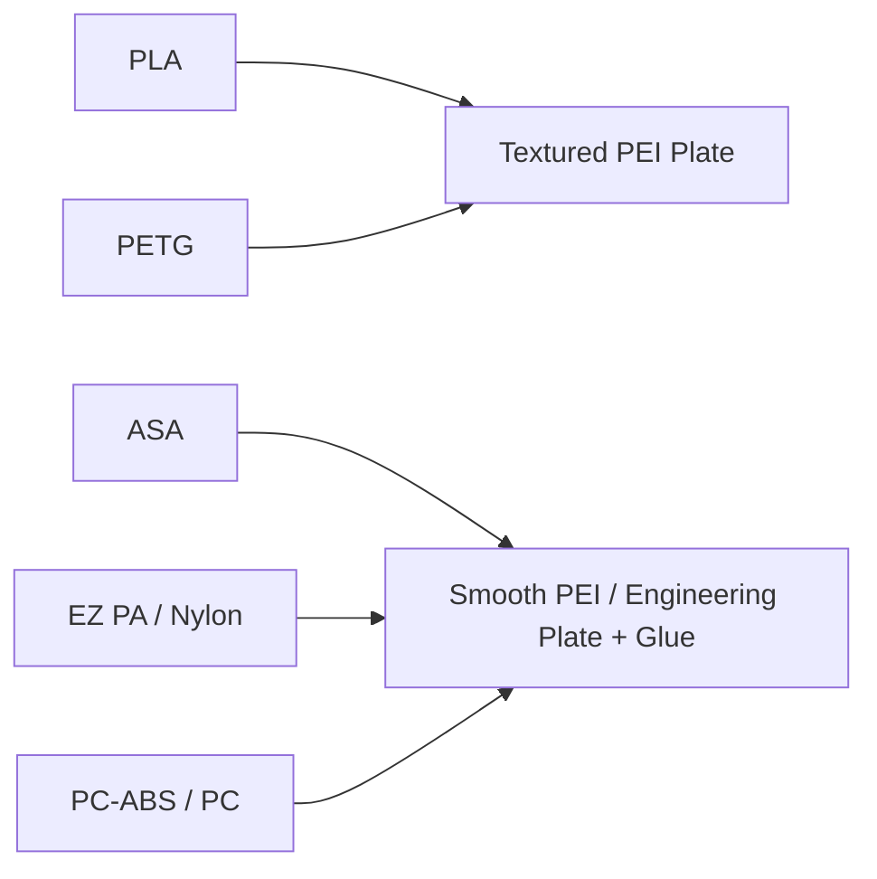

# ⚙️ Bambu X2D Hardware & Setup Guide

> [!NOTE] Onboarding Guides
> * Looking to buy or budget your setup? See [[01a - Bambu X2D Buyer's Guide & Purchase Checklist]].
> * New to 3D printing and slicing? Start with [[01b - Beginner 101 & Slicer Fundamentals]].

The **Bambu X2D** is an advanced, dual-extrusion 3D printer built specifically for high-reliability printing with both standard consumer plastics and industrial engineering filaments.

---

## 🛠️ Key Machine Architecture

### 1. Dual Independent Nozzle System
* **Main Nozzle:** Dedicated to extruding your primary model material (e.g., PLA, PETG, ASA, Nylon, PC-ABS).
* **Auxiliary Nozzle:** Dedicated to support interface materials (e.g., `Support for ABS`, `Support for PLA/PETG`, or ASA).
* **Why it matters:** Eliminates the massive purge waste of single-nozzle multi-material units (MMU/AMS), prevents cross-contamination of polymers, and enables true **zero-gap support printing** for overhangs.

### 2. Actively Heated Enclosed Chamber
* Unlike passive enclosures that only trap bed heat, the X2D actively regulates ambient chamber temperatures up to 60–80°C+.
* **Benefit:** Prevents layer delamination and corner warping on high-shrinkage materials like ASA, ABS, PC, and Nylons.
* **Best Practice:** Always preheat the chamber for 15–20 minutes before starting engineering prints.

### 3. Hotend & Nozzle Options
* **0.4 mm Hardened Steel:** Standard all-rounder. Great for detailed Gridfinity bins, openGrid snaps, and general parts.
* **0.6 mm Hardened Steel:** Recommended for carbon-fiber (CF) or glass-fiber (GF) filled materials (e.g., PA6-CF, PA12-CF, ABS-GF). The wider bore drastically reduces fiber clogging and wear.

---

## 🧰 Essential Tool & Accessory Checklist

Before your printer arrives, having these tools ready will ensure a smooth setup:

- [ ] **Filament Dryer / Active Dry Box:** Engineering plastics (especially Nylons and PC) absorb atmospheric moisture within hours. A heated dryer that can feed directly into the printer via PTFE tubing is essential.
- [ ] **Digital Calipers (6" / 150mm):** Crucial for measuring tools, drawer depths, and tolerances for Gridfinity bins and garage brackets.
- [ ] **Build Plate Cleaning Supplies:** 99% Isopropyl Alcohol (IPA) and a lint-free microfiber cloth (plus Dawn dish soap for periodic deep degreasing).
- [ ] **Bed Adhesives:** PVA glue stick or Bambu liquid glue for engineering plates (acts as both an adhesive for ASA and a release agent for PETG/PC).
- [ ] **Gridfinity Supplies:** 6mm diameter x 2mm thickness neodymium disc magnets.
- [ ] **Deburring Tool & Flush Cutters:** For cleaning brim edges and trimming zip ties / support spurs.

---

## 💨 Safety, Fumes & Ventilation

> [!WARNING] Ventilation Requirements
> * **PLA & PETG (Phase 1):** Produce minimal odor and low VOCs. Safe for standard indoor office/desk environments.
> * **ASA, ABS, PC-ABS & PC (Phase 2):** Emit styrene and volatile organic compounds (VOCs) and ultra-fine particles (UFPs) when heated.
> * **Action Plan:** Print in a well-ventilated room, garage, or connect an active exhaust/carbon filter to the printer's rear exhaust port.
> * **Fiber Dust:** When sanding or post-processing Carbon Fiber (CF) or Glass Fiber (GF) prints, wear a particle mask (N95/FFP2).

---

## 🧼 Build Plate Selection

* **Textured PEI Sheet:** Best for PLA, PETG, and TPU. Parts pop off naturally once the plate cools to room temperature.
* **Smooth PEI / Engineering Plate with Glue:** Best for high-temp engineering filaments (ASA, PC-ABS, Nylon). The glue provides uniform first-layer grip while preventing the plastic from bonding permanently to the PEI sheet.

---

**Next Step:** Check out [[02 - Filament & Material Selection]] to build your filament inventory strategy, or return to [[00 - 3D Printing Hub]].
