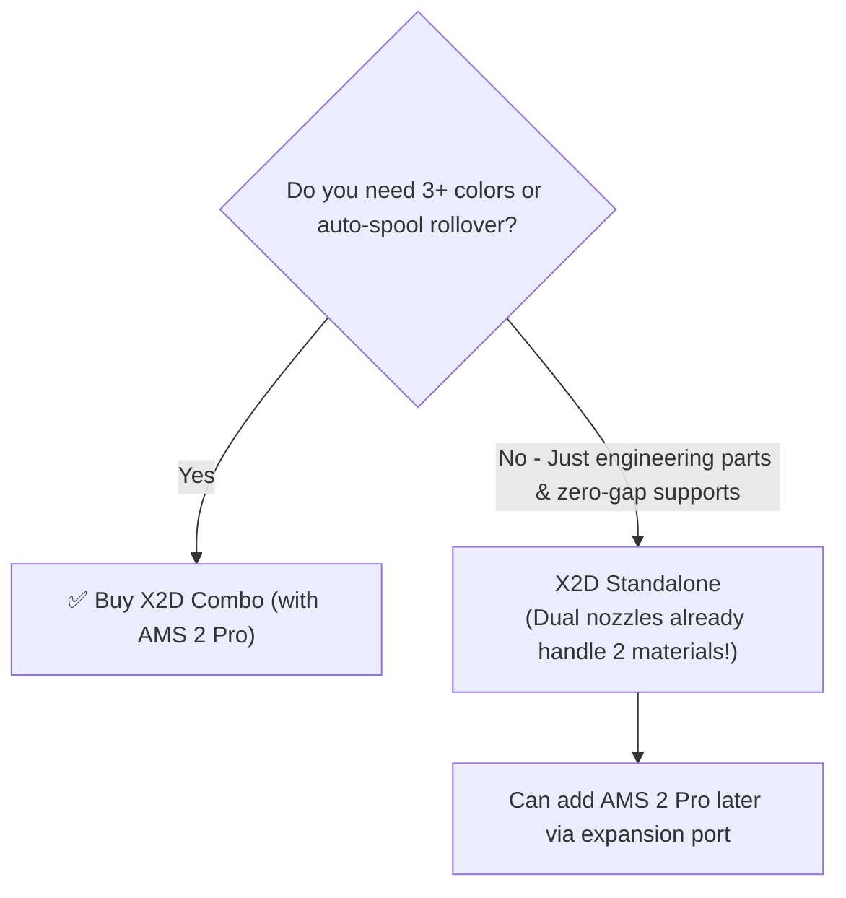

# 🛒 Bambu X2D Buyer's Guide & Pre-Purchase Checklist

Investing in your first 3D printer is exciting, but buying the machine is only step one. This guide breaks down the financial investment, hardware choices, workspace requirements, and Day 1 accessories to make sure you hit the ground running with zero surprises.

---

## ⚖️ Standalone X2D vs. X2D Combo (with AMS 2 Pro)

The most critical buying decision is whether to get the **X2D Standalone** or the **X2D Combo with AMS 2 Pro**.

### The Key Difference
* **The X2D already has Dual Nozzles:** Unlike single-nozzle printers (X1C, P1S, A1) that require an AMS to switch between model and support material (causing slow purge cycles and filament "poop"), the X2D independently runs two materials simultaneously. 
* **What the AMS 2 Pro Adds:**
  1. **Multi-color capacity:** Increases available filaments from 2 to 5 (or more if chained).
  2. **Active Spool Drying:** Keeps hygroscopic materials (Nylon, PETG, PC) dry right inside the feeder box during multi-day prints.
  3. **Auto-spool rollover:** Automatically switches to a fresh spool when the current spool runs out mid-print.
  4. **RFID auto-detection:** Instantly loads Bambu spool color and material profiles without manual typing.

> [!TIP] Buying Recommendation
> If your budget permits, **the Combo is strongly recommended**. Buying the AMS 2 Pro bundled with the printer is significantly cheaper than purchasing it separately later, and the integrated drying system is invaluable for the engineering materials (ASA/Nylon) you'll use in [[04 - Phase 2 - Garage & Workshop Tool Organization|Phase 2]].

---

## 💰 Total Cost of Ownership (TCO) & Budget Breakdown

Beyond the printer, budget for plates, spare nozzles, filament, and tools.

| Category | Item | Approx. Cost | Priority | Notes |
| :--- | :--- | :--- | :--- | :--- |
| **Printer** | Bambu X2D (Standalone or Combo) | \$1,299 – \$1,699 | Essential | Flagship dual-extrusion CoreXY printer |
| **Plates** | Dual-Sided Textured PEI Plate | Included / \$35 | Essential | Best for PLA, PETG, TPU (parts release when cool) |
| **Plates** | Smooth PEI / Engineering Plate | \$35 – \$45 | Recommended | Required for ASA, PC-ABS, and Nylon with glue |
| **Hotends** | 0.4 mm Hardened Steel Nozzle Assembly | Included | Essential | Default precision hotend |
| **Hotends** | 0.2 mm Hardened Steel Nozzle Assembly | \$35 – \$45 | Recommended | Essential for [[10 - Precision Printing & ZSA Voyager Keycaps (0.2mm Nozzle)\|ZSA Voyager Choc keycaps]] & miniatures |
| **Hotends** | 0.6 mm Hardened Steel Nozzle Assembly | \$35 – \$45 | Recommended | Essential for carbon-fiber (CF) or glass-fiber (GF) |
| **Filaments** | Starter Filament Bundle (4–6 spools) | \$100 – \$150 | Essential | 2x PLA, 2x PETG, 1x Support for PLA, 1x ASA |
| **Adhesives** | Bambu Liquid Glue or PVA Glue Stick | \$15 – \$20 | Essential | Adhesion for ASA; release agent for PETG/PC |
| **Tools** | 6" / 150mm Digital Calipers | \$20 – \$35 | Essential | Crucial for measuring parts and checking tolerances |
| **Tools** | Flush cutters, deburring tool, scraper | \$15 – \$25 | Essential | For brim cleaning and support removal |
| **Cleaning** | 99% Isopropyl Alcohol (IPA) + Microfiber | \$15 – \$20 | Essential | For degreasing plates between prints |
| **Storage** | Vacuum storage bags + dry silica gel | \$25 – \$40 | Essential | Prevents wet filament clogs and stringing |
| **Safety** | HEPA/Carbon exhaust or filter ducting | \$30 – \$60 | Situational | Essential if printing ASA/ABS indoors |
| **TOTAL** | **Realistic Day 1 Total** | **~\$1,600 – \$2,150** | — | Includes tax, shipping, and initial supplies |

---

## 📐 Workspace, Power & Environmental Readiness

Before placing the order, prepare your physical space:

### 1. Physical Footprint & Weight
* **Printer Dimensions:** ~389 × 389 × 457 mm (approx. 15.3 × 15.3 × 18 inches).
* **Clearance Requirements:**
  * **Rear:** Allow at least **15–20 cm (6–8 inches)** behind the machine for the external spool holder, PTFE tube arc, and the **poop chute**.
  * **Top:** Allow **25–30 cm (10–12 inches)** of overhead clearance if mounting the AMS 2 Pro on top.
* **Vibration Stability:** The X2D is an ultra-fast CoreXY machine with high acceleration. Place it on a **heavy, rigid workbench, butcher block, or sturdy desk**. A wobbly folding table will cause ringing/ghosting on your prints.

### 2. Electrical Power Draw
* **Chamber Heating:** Unlike standard printers that draw only 150–350W, the X2D's actively heated chamber and high-power heated bed can draw **800–1200W peak** during initial warmup.
* **Circuit:** Connect to a dedicated 15A or 20A household circuit. Avoid running high-draw appliances (space heaters, laser cutters, microwaves) on the same circuit simultaneously.

### 3. Ventilation & Noise
* **Indoor Desk vs. Garage:**
  * If placed in a home office: You can print **PLA and PETG** without odor. For **ASA, ABS, and PC-ABS**, you must vent exhaust out a window or through an active carbon scrubber.
  * If placed in a garage or workshop: Ensure ambient temperature stays above 10°C (50°F) in winter, and preheat the chamber before starting engineering prints.

---

## 📋 The "Day 1" Shopping List

Use this interactive checklist when placing your initial order:

### From Bambu Lab Store
- [ ] Bambu X2D 3D Printer (or X2D Combo)
- [ ] Extra 0.4 mm Hardened Steel Complete Hotend (good to have a ready spare)
- [ ] 0.2 mm Hardened Steel Complete Hotend (essential for [[10 - Precision Printing & ZSA Voyager Keycaps (0.2mm Nozzle)|ZSA Voyager Choc keycaps]] and ultra-fine miniatures)
- [ ] 0.6 mm Hardened Steel Complete Hotend (for future fiber-filled filaments)
- [ ] Dual-sided Textured PEI Plate (if not included)
- [ ] Bambu 4-in-1 PTFE Adapter (~$5, allows external TPU feed line to stay connected alongside AMS)
- [ ] Bambu Spare PTFE Tubing (2–4m pack, for external spool routing to 4-in-1 adapter)
- [ ] Bambu Liquid Glue (or glue stick — essential release agent for TPU on Textured PEI)
- [ ] Spool: Bambu PLA Basic (2x spools, neutral colors like Black/Grey)
- [ ] Spool: Bambu PETG-HF (2x spools, ideal for [[03 - Phase 1 - Desk Organization (Gridfinity & Multiboard)|Multiboard & Underware]])
- [ ] Spool: Bambu Support for PLA/PETG (1x spool for auxiliary nozzle)
- [ ] Spool: Bambu ASA (1x spool to test garage mounts)
- [ ] Spool: Bambu Support for ABS (1x spool for auxiliary nozzle zero-gap testing)
- [ ] Spool: Bambu TPU 95A HF (1–2 spools for [[09 - 3D Printed Footwear (Sneakers, Clogs & TPU)|shoes, clogs, and slides]])

### From Amazon / Local Hardware Store
- [ ] Digital Calipers (Stainless steel, reads mm to 0.01mm)
- [ ] 10-Pack of 608-2RS Ball Bearings (~$6–$8, for 3D printing a zero-friction external spool roller for TPU)
- [ ] Active Heated Filament Dryer Box (Sunlu S2, Sovol SH01, or Creality Space Pi; recommended for 12–20hr TPU shoe prints)
- [ ] 99% Isopropyl Alcohol (1 quart / 1 liter)
- [ ] Microfiber cleaning cloths (lint-free)
- [ ] Deburring tool with swivel blade (for trimming brim edges)
- [ ] Pack of 6mm x 2mm Neodymium disc magnets (for Gridfinity)
- [ ] Filament vacuum storage bags with hand pump
- [ ] Color-indicating reusable silica gel desiccant beads
- [ ] Dawn Dish Soap (original blue formula for deep plate degreasing)

---

## 📦 Unboxing & Delivery Inspection Checklist

When your printer arrives at your door, follow these steps before powering on:

1. **Inspect Outer Carton:** Check for puncture marks, heavy dents, or water damage before signing.
2. **Remove Transit Brackets & Screws:** The X2D uses transit security screws to lock the heatbed and toolhead during shipping. **Do NOT power on the machine until all brightly colored transit thumbscrews and foam blocks are removed.**
3. **Inspect Carbon Rods:** Check the X-axis carbon rods for any grit or scratches.
4. **Toolhead Movement:** Gently slide the toolhead by hand to verify smooth travel along X and Y axes with no catching.
5. **Initial Power On:** Follow the on-screen touchscreen wizard to run the full automated calibration routine (approx. 15–20 minutes).

---

**Next Step:** Head to [[01b - Beginner 101 & Slicer Fundamentals]] to learn how slicing software works and how to prepare your first test print.
