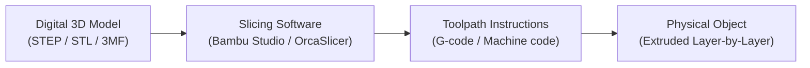
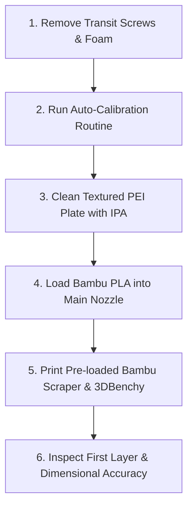

# 🎓 Beginner 101 & Slicer Fundamentals

If this is your first 3D printer, welcome! 3D printing may look complex from the outside, but once you understand the basic pipeline from digital model to sliced layers, you will be able to print reliable parts consistently.

---

## 🔄 The 3D Printing Pipeline



1. **The Model:** A digital 3D geometry file.
2. **The Slicer:** Software on your PC/Mac that slices the 3D model into horizontal 2D slices (e.g., 0.2 mm tall) and calculates exact motor speeds, temperatures, and plastic flow.
3. **The G-code / 3MF:** The machine instructions sent over Wi-Fi to your Bambu X2D.
4. **The Print:** Your printer heats up, levels the bed, and traces each layer on top of the previous one until the object is complete.

---

## 📁 File Formats: Which One Should You Use?

| Format | Meaning | Best For | Why It Matters |
| :--- | :--- | :--- | :--- |
| **`.step` / `.stp`** | Standard for Exchange of Product model data | **Functional & CAD parts** | **Best quality.** Contains true mathematical curves instead of triangles. Slicers generate smoother arcs with zero faceted surfaces. |
| **`.3mf`** | 3D Manufacturing Format | **Bambu Studio / MakerWorld** | Contains not just the shape, but also your **exact slicer settings, colors, support placements, and orientation**. |
| **`.stl`** | Stereolithography | Legacy models | The classic format. Represents shapes as a mesh of flat triangles. Works fine, but curved surfaces can show tiny facets if low-resolution. |

> [!TIP] Pro Tip for CAD Models
> Whenever downloading or exporting functional parts (Gridfinity, brackets, tool holders), always download the **`.step`** file if available. It produces stronger, cleaner, and more accurate dimensions than `.stl`.

---

## 🌐 Where to Find 3D Models

1. **[MakerWorld](https://makerworld.com):** Built by Bambu Lab. Offers "1-Click Print" directly from your phone or Bambu Studio, with community-verified print profiles.
2. **[Printables](https://printables.com):** Maintained by Prusa. The gold standard for high-quality functional designs, workshop organizers, and engineering prints.
3. **[Thangs](https://thangs.com):** A 3D search engine that searches across MakerWorld, Printables, Thingiverse, and Cults3D simultaneously.
4. **[Thingiverse](https://thingiverse.com):** The oldest repository; vast library of legacy designs.

---

## ⚙️ Slicer Settings Demystified (Bambu Studio / OrcaSlicer)

When you import an object into Bambu Studio, you control how it is built. Here are the 5 settings you must know:

### 1. Walls (Perimeters) vs. Infill
```
   [Outer Wall] [Inner Wall] [Infill Pattern] [Inner Wall] [Outer Wall]
   |<------------ Wall Thickness ------------>|
```
* **Walls = Strength:** The vertical shells that make up the outer boundary of your part.
  * *Decorative / desk toys:* 2 walls.
  * *Functional organizers ([[03 - Phase 1 - Desk Organization (Gridfinity & Multiboard)|Gridfinity/Multiboard]]):* 3 to 4 walls.
  * *Heavy-duty garage brackets ([[04 - Phase 2 - Garage & Workshop Tool Organization|Phase 2]]):* 5 to 6 walls.
* **Infill = Internal Support & Weight:** Infill only supports the ceiling of your part and adds modest stiffness. **Increasing walls from 2 to 4 adds dramatically more strength than increasing infill from 20% to 60%!**

### 2. Infill Patterns: Gyroid vs. Grid
* **The "Grid" Infill Trap:** The default pattern in many slicers is *Grid*. Grid infill crosses over itself on the exact same layer, creating tiny plastic bumps where lines intersect. At high speeds, your nozzle will slam into these bumps, causing loud scraping sounds or knocking tall prints off the build plate!
* **The Fix: Use `Gyroid` or `Adaptive Cubic`:**
  * **Gyroid:** Wavy, continuous 3D structure that never crosses itself on a single layer. Equal strength in all directions, prints cleanly, and handles vibrations well.
  * **Adaptive Cubic:** Dense near the top surfaces (to support top layers) and hollow near the center (saves filament and print time).

### 3. Layer Height (Z-Resolution)
* **`0.08 mm – 0.12 mm` (Fine / Detail):** Ultra-smooth layer lines. Best for miniatures, curved figurines, or crisp screw threads. Prints slower.
* **`0.20 mm Standard` (Default Sweet Spot):** The perfect balance between speed, strength, and visual quality. Use this for 80% of all prints.
* **`0.28 mm Draft` (Speed):** Thick, visible layers. Best for large structural test boxes, Gridfinity drawer baseplates, or quick prototypes.

### 4. Supports: Normal vs. Tree (Organic)
Supports are temporary scaffolding that hold up overhangs steeper than ~45°–50°.
* **Tree Supports (Auto):** Trunk-and-branch structures that wrap around parts. They use far less filament, are much faster to print, and touch the model at fewer points (easier to remove with minimal scarring).
* **Normal (Linear) Supports:** Vertical accordion towers. Best when supporting wide, completely flat horizontal ceilings or bridge undersides.
* **With the X2D:** Remember that your auxiliary nozzle can print the support interface in a zero-weld material for glass-smooth release (see [[05 - X2D Dual Extrusion & Support Workflow]]).

### 5. Bed Adhesion: Brim vs. Skirt
* **Brim:** An extra flat flange printed around the base of the part to prevent corners from curling up (warping).
  * *Auto Brim / Outer Brim (5–10 mm):* Recommended for sharp rectangular corners, tall skinny items, or high-shrink materials like ASA.
* **Mouse Ears:** Tiny round discs placed only on sharp corners instead of an entire brim—stops corner peeling without tedious trimming.
* **Skirt:** A single loop printed around the perimeter of the bed before the print starts. It primes the nozzle and confirms bed leveling.

---

## 🚀 Step-by-Step: Your Very First Print Day

When your printer is unboxed, follow this exact workflow:



1. **Check Transit Screws:** Verify the bed and toolhead transit screws are completely removed.
2. **Run Calibration:** From the touchscreen, run the **Full Self-Test & Vibration Calibration** (~15–20 min). The printer will vibrate at varying frequencies to calibrate input shaping (anti-ghosting).
3. **Clean Build Plate:** Wipe the textured PEI plate down with 99% IPA and a microfiber cloth. Avoid touching the center with bare fingers!
4. **Load PLA Filament:** Feed your spool of Bambu PLA into the main toolhead. The built-in cutter and extruder will auto-load and purge a small bead.
5. **Print a 3DBenchy:** Select the pre-loaded 3DBenchy boat from the printer's internal memory. It should complete in under 20 minutes with crisp overhangs and clean lettering on the stern.
6. **Print the Bambu Scraper:** Print the handle for the metal scraper blade included in your accessory box. (See [[Starter Project - Bambu Scraper & Poop Chute Bin]]).

---

**Next Step:** Review [[01 - Bambu X2D Hardware & Setup]] for machine-specific features, and [[02 - Filament & Material Selection]] for filament properties.
