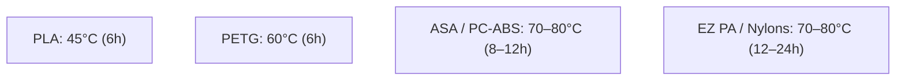

# 🧵 Filament & Material Selection Guide

Choosing the right material prevents failed prints and ensures your finished parts withstand their intended environment. This guide divides materials into **Standard (Phase 1)** and **Engineering (Phase 2)** grades.

---

## 📊 Quick Comparison Matrix

| Filament | Grade | Difficulty | Heat Resistance (HDT) | UV / Weather | Best For | Support Interface (X2D Aux) |
| :--- | :--- | :--- | :--- | :--- | :--- | :--- |
| **PLA / PLA+** | Standard | ⭐ (Easiest) | ~50–55°C | Poor | Desk organizers, Gridfinity, prototyping | PETG / `Support for PLA` |
| **TPU 95A** | Flexible | ⭐⭐ (Easy-Mod) | ~60°C | Good | Shoe outsoles, clogs, bumpers, tool grips | `Support for PLA/PETG` |
| **Foaming TPU** | Flexible/Foam| ⭐⭐⭐ (Moderate)| ~65°C | Good | Running midsoles, cloud clogs, EVA foam feel | `Support for PLA/PETG` |
| **EZ PA (Nylon)**| Engineering | ⭐⭐ (Easier) | **121°C** | Good | Snap-fits, living hinges, tough tool clips | `Support for ABS` |
| **ASA** | Engineering | ⭐⭐⭐ (Moderate)| **~100°C** | **Excellent** | Garage wall mounts, outdoor signage, automotive | `Support for ABS` |
| **PC-ABS** | Engineering | ⭐⭐⭐ (Moderate)| **~103°C** | Moderate | Heavy tool racks, drill holsters, impact parts | `Support for ABS` |
| **PA12-CF** | Engineering | ⭐⭐⭐ (Moderate)| Moderate/High | Good | Stable jigs, structural brackets (low moisture)| `Support for ABS` |
| **PA6-CF / GF** | Engineering | ⭐⭐⭐⭐ (Hard) | **~182–186°C** | Excellent | Extreme stiffness (CF) or drop-proof (GF) | ASA (for CF) / `Support for ABS` (for GF) |
| **PC (Pure)** | Engineering | ⭐⭐⭐⭐⭐ (V. Hard)| **130°C+** | High | Maximum structural & extreme heat casings | ASA or `Support for ABS` |

---

## 🟢 Part 1: Standard Filaments (For Phase 1 Desk Setup)

### 1. PLA (Polylactic Acid) / PLA+
* **Overview:** The undisputed king of ease-of-use. Stiff, crisp details, zero warp, and wide color availability.
* **Why use it for Desk Setup:** Perfect for [[03 - Phase 1 - Desk Organization (Gridfinity & openGrid)#Gridfinity Basics|Gridfinity bins]] and drawer bases where temperature is climate-controlled and impact forces are negligible.
* **Limitation:** Glass transition temperature is ~55°C. **Never use PLA in a hot car or uninsulated garage in summer**, as parts will soften and sag under load.

### 2. PETG (Polyethylene Terephthalate Glycol) — Bambu PETG Basic
* **Overview:** More flexible and impact-resistant than PLA, with higher temperature tolerance (~75°C) and superior creep resistance under constant load.
* **Bambu Formulation Note:** Bambu Lab phased out their older *PETG-HF* (High Flow) and replaced it with a reformulated **PETG Basic**. The reformulated PETG Basic dramatically enhances Z-axis layer bonding, tensile strength, and impact resistance—making it substantially superior for snap-fit latches and structural brackets.
* **Why use it:** Essential for climate-controlled office organization: [[03 - Phase 1 - Desk Organization (Gridfinity & openGrid)#Level 2 openGrid Islands for French Cleats|openGrid tiles]], Multiconnect snap clips, and [[03 - Phase 1 - Desk Organization (Gridfinity & openGrid)#Level 3 Underware for openGrid Under-Desk Cable Management|Underware cable raceways]]. Deploy **Lite** profile for under-desk routing/drawers and **Full** profile for wall cleat cartridges.
* **Garage Limitation:** In unconditioned summer garages (reaching 50°C–60°C under hot car engine dissipation), PETG can slowly experience **thermal creep** under continuous heavy cantilevered tool weight. Use **ASA** for garage walls instead.

### 3. Flexible & Footwear Polymers (TPU 95A, 85A & Foaming TPU)
* **Overview:** Elastic, rubber-like thermoplastic polyurethanes with extreme abrasion resistance and tear strength.
* **Why use it:** Essential for wearable footwear ([[09 - 3D Printed Footwear (Sneakers, Clogs & TPU)|3D Printed Shoes & Clogs]]), shock-absorbing gaskets, and non-marring tool bumpers.
* **Critical Feeding Rules:** Never feed flexible TPU into the AMS/AMS 2 Pro (it buckles and jams the feeder gears). Feed externally via a **Bambu 4-in-1 PTFE Adapter** directly to the toolhead. Mount the spool on a **608 ball-bearing roller** or feed directly from an active heated dry box to eliminate tensile drag (which causes under-extrusion). Always coat Textured PEI with glue stick or liquid glue as a **sacrificial release barrier** to prevent TPU from permanently welding to the plate.

---

## 🔴 Part 2: Engineering Filaments (For Phase 2 Garage & Workshop)

### 1. EZ PA (Sunlu Easy PA — PA6/66 Copolymer)
* **Status:** The ideal entry-level Nylon.
* **Strengths:** Engineered for low shrinkage and minimal warping. Resists abrasions, impacts, oils, and chemicals while offering a high HDT of **121°C**.
* **Ideal Garage Use:** Tool spring clips, snap-in wrench holders, and brackets that get repeatedly pulled or flexed.

### 2. ASA (Acrylonitrile Styrene Acrylate)
* **Status:** The premier outdoor and garage workhorse.
* **Strengths:** Full UV resistance (won’t turn brittle or yellow in sunlight), high heat resistance (~100°C), and high mechanical rigidity.
* **Ideal Garage Use:** Heavy pegboard hooks, power-strip wall brackets, garden tool mounts, battery charging cradles, and **all garage openGrid wall tiles (Full profile)** to guarantee zero summer sag.
* **Bambu X2D Printing Advantage:** Printed effortlessly using the X2D's 65°C heated chamber with `Support for ABS` in the secondary nozzle for zero-gap breakaway support surfaces.

### 3. PC-ABS (Polycarbonate / ABS Blend)
* **Status:** Industrial impact resistance without the extreme printing difficulty of pure PC.
* **Strengths:** High dimensional stability, excellent layer bonding, and high impact resistance (absorbs shocks that would shatter ABS or PLA).
* **Ideal Garage Use:** Heavy cordless drill wall holsters, hammer hooks, and torque-bearing tool racks.

---

## 💧 Filament Drying & Storage Guidelines

> [!IMPORTANT] Engineering Materials "Drink" Water
> Nylons and PC-ABS are hygroscopic and pull moisture directly from the air within 2 to 4 hours of exposure. Wet filament leads to popping sounds at the nozzle, steam, stringing, and weak chalky parts.

### Recommended Drying Parameters

* **Best Practice:** Store all spools in vacuum bags with dry silica desiccant or keep them loaded inside a heated dry box feeding straight to the X2D.

---

**Next Step:** See [[03 - Phase 1 - Desk Organization (Gridfinity & openGrid)]] to start printing your first batch of modular organizers.
