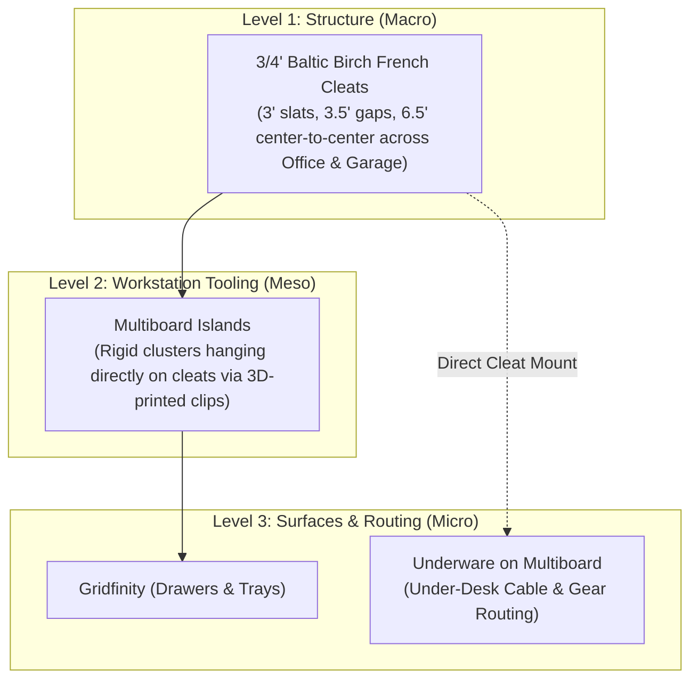

# 📦 Phase 1: Workspace Organization & The Three-Tier Stack

The best way to master your Bambu X2D is by creating practical, modular organization systems for your workspace. Instead of treating your office and garage as separate disconnected worlds, we deploy a **Unified Three-Tier Organization Stack** that standardizes on **3/4" Birch French Cleats** as universal room-scale infrastructure, with **Multiboard Islands** and **Gridfinity / Underware** handling desktop and drawer precision.

---

## 🏛️ The Unified Three-Tier Hierarchy



| Level | Scale | System | Physical Implementation | Role |
| :--- | :--- | :--- | :--- | :--- |
| **Level 1: Structure (Macro)** | Walls (Office & Garage) | **3/4" French Cleats** | 3" slats, 3.5" clear gaps ($6.5"$ center-to-center). Ripped from 3/4" Birch. | Universal room-scale architectural backbone. Single table saw setup. |
| **Level 2: Tooling (Meso)** | Wall Clusters & Focal Zones | **Multiboard Islands** | Rigid 2x2 or 3x3 Multiboard clusters hanging on cleats via 3D-printed clips. | High-density tool & gear zones (calipers, snips, headphones, stream deck). |
| **Level 3: Micro** | Drawers & Under-Desk | **Gridfinity & Underware** | 42mm modular Gridfinity bins inside drawers; Underware on Multiboard tiles under desk. | Fine in-drawer sorting and modular under-desk cable/gear routing without re-drilling wood. |

---

## 💡 Why This Hybrid Architecture Works So Well

1. **Single Setup at the Table Saw:** You set your table saw fence once ($5.85"$), tilt your arbor once to $45.0^\circ$, and cut your $3.50"$ story-stick spacer blocks once. No managing multiple slat profiles or bespoke cut sheets between the garage and office.
2. **Solves Multiboard’s Wall-Mounting Weakness:** Screwing individual Multiboard tiles directly into drywall with plastic anchors is tedious, damages walls, and can bow under load. Mounting a Multiboard cluster to two wooden cleat runners gives it a rock-solid, flat backer that you can lift off the wall, reconfigure on a table, and drop right back in place.
3. **Eliminates the "Visual Clutter" Problem:** Tiny, individual 3D-printed hooks scattered haphazardly across wide wooden slats look chaotic in an office. Clustering your desktop tools (calipers, snips, headphones, stream deck, audio DAC) onto a framed, intentional **Multiboard Island** creates a professional, designer aesthetic.
4. **Complete Cross-Space Interoperability:** Because the cleats are 100% identical in the office and garage:
   * You can move a battery charger rack, a tool caddy, or a parts bin straight from the garage to the office desk without changing mounting hardware.
   * Any Multiboard island or Gridfinity shelf you build for the office can easily hang on a garage wall whenever you reconfigure.

---

## 🧱 Level 2: Multiboard Islands for French Cleats

Created by Keep-Making, **Multiboard** combines standard pegboard holes, threaded screw bosses, and T-slots into an interlocking modular grid. Instead of anchoring to drywall, we mount it as a **removable cleat-hung island**.

```
             DUAL-CLEAT MULTIBOARD ISLAND (Zero Wobble)
             
                  Wall Studs ──|
                               |  +-------------------+
                   Cleat Row 1 |  | Top Cleat         /
                               |  +---\---------------+
                               |       \  [3D Cleat Clip]
                               |        \   |
                               |         \==+==================+
                               |            |                  |
                   3.5" Gap    |            |  Multiboard      |
                               |            |  Core Tile (8x8) |
                               |            |                  |
                               |  +---------+                  |
                   Cleat Row 2 |  | Mid Cleat /                |
                               |  +---\-----+                  |
                               |       \  [Dual-Cleat Catch]   |  <-- Prevents inward
                               |        \   |                  |      swing when pressing
                               |         \==+==================+      in accessories!
```

### 1. The 3 Essential Hardware Components for Multiboard Islands
1. **Dual-Cleat Backer Brackets ($6.5"$ or $13"$ Span):**
   * With a 3" cleat and 3.5" clear gap, row spacing is **$6.5"$ center-to-center**.
   * By designing your 3D-printed Multiboard bracket to catch **two consecutive cleats**, you gain vertical leverage. When you push a heavy tool or cable plug into the Multiboard, the bottom cannot swing inward toward the wall.
2. **Bottom Offset Plumb Spacer ($3/4"$ Standoff):**
   * If you hang a small 1x1 or 2x1 mini tile cluster from only a single top cleat, attach a printed **3/4" standoff block** to the bottom corners. This ensures the island hangs dead plumb against the wall rather than tilting backwards.
3. **Anti-Lift Safety Cam-Locks / M4 Thumbscrews:**
   * In an office, you frequently pull items upward and outward (e.g., lifting headphones or pulling a charging cable). A simple printed cam-lock or M4 thumbscrew under the upper cleat hook locks the island securely so it cannot accidentally jump off the rail.

### 2. Office Aesthetics: Blending Wood & Tech
* Sand your 3/4" Birch cleats to 220 grit, apply a slight 1/8" roundover on the exposed edges, and finish with a clear satin polyurethane or hardwax oil (e.g., Rubio Monocoat / Osmo).
* Pair with matte black, charcoal grey, or accent-colored PETG Multiboard tiles for a modern, high-end studio look.

### 3. Recommended Multiboard Slicer Settings
* **Filament:** **PETG** (slight elasticity prevents snap hooks and bolt bosses from snapping).
* **Walls / Perimeters:** **3 to 4 walls**.
* **Infill:** `20% Gyroid`.

---

## 🗄️ Level 3: Gridfinity (Drawers & Desktop Trays)

Created by Zack Freedman, **Gridfinity** is the open-source standard for modular drawer compartmentalization.

```
+-------------------+
|  42mm x 42mm Base |   <-- 1 Unit (1U width/depth)
|  [Magnet] [Magnet]|   <-- 6x2mm magnet holes
+-------------------+
```

* **Grid Unit:** **42 mm x 42 mm** per square.
* **Height Units:** Increments of **7 mm** (3U = 21mm shallow drawer; 6U = 42mm deep bin).
* **Magnets:** Corners accept **6 mm diameter x 2 mm thick** neodymium disc magnets.
* **Cleat Integration:** You can print a **French-Cleat-to-Gridfinity Shelf** that hangs directly on your wall cleat, giving you a floating dock for small screw bins, calipers, or SD card holders!
* **Filament:** **PLA / PLA+** (crisp details, rigid bases).

---

## 🔌 Level 3: Underware on Multiboard (Under-Desk Cable Management)

Standardizing on **Multiboard as your under-desk substrate** lets you take full advantage of *Hands on Katie's* **Underware** ecosystem while eliminating the need for a third grid standard like openGrid.

### 🛑 Why Drop openGrid? The "Golden Duo" Advantage
* **Ecosystem Consolidation:** Instead of slicing, organizing, and stocking parts for three different grids (Gridfinity, Multiboard, openGrid), you only manage **Multiboard (25mm)** and **Gridfinity (42mm)**.
* **Parts Reuse:** Push-fit pegs, T-bolts, cable ties, and clips are 100% interchangeable between your wall cleat islands and your under-desk sub-grid.
* **Slicer Efficiency:** Standard print profiles in Bambu Studio for Multiboard tiles work identical whether the tile is destined for an eye-level wall island or hidden under the desktop.

### 🔩 The "Screw Once" Under-Desk Foundation
Instead of drilling bespoke screw holes into the underside of your desk every time you acquire a new monitor, laptop dock, or USB hub:

1. **Mount Multiboard Inverted Beneath the Desk:**
   * Print 2 to 4 standard **Multiboard Core Tiles** (e.g. 8x8 or 6x8) in **PETG**.
   * Secure the tiles flat against the underside of the desktop using low-profile **#8 x 1/2" (or 5/8") pan-head wood screws** directly through Multiboard's countersunk mounting holes.
   * Space tiles along the rear cable-routing zone or directly beneath your monitor arm mount.
2. **Infinite Modular Reconfiguration:**
   * You only drill into your desk wood **once**.
   * Any future addition—cable clips, power brick cradles, dock sleds—snaps mechanically into the Multiboard grid holes via Underware snap pegs or Multiboard T-bolts.
   * If you rearrange your desk or change computers, unclip and reposition without leaving screw holes in your furniture.

```
                      DESKTOP UNDERSIDE (Cross-Section)
═══════════════════════════════════════════════════════════════════ Desktop Wood
       │ #8x1/2" Pan-Head Screw                    │ #8x1/2" Screw
   ┌───┴───────────────────────────────────────────┴───┐
   │       Inverted Multiboard Tile Substrate (PETG)   │ (25mm Grid)
   └─────┬───────────────────────────────────────┬─────┘
         │ Multiboard Push-Fit Peg               │ Underware Snap Clip
   ┌─────┴──────────────┐                  ┌─────┴────────────────┐
   │ Underware Raceway  │ (Cable Routing)  │ Clamping Brick Arm   │ (Power Brick)
   │ [ ⚡ Power / USB ] │                  │ [ 140W Charger Block]│
   └────────────────────┘                  └──────────────────────┘
```

### 🧩 Underware Modules on Multiboard
* **Parametric Cable Raceways:** Snap-in J-hooks and spine channels that lock into Multiboard pegs, keeping thick power cords, DisplayPort cables, and USB-C lines neatly bundled and out of sight.
* **Heavy-Duty Clamping Brick Cradles:** Dual-sided tension arms that firmly squeeze heavy laptop chargers (65W to 240W bricks) and monitor power supplies flush against the underside of the desk to prevent sagging.
* **Thunderbolt Dock & USB Hub Sleds:** Cradles sized for CalDigit TS4, Dell, or Anker docks that permit passive heat dissipation downward while keeping desk surfaces 100% clear.
* **Filament Recommendation:** **PETG** is strictly required here. PLA will experience plastic creep under constant screw torque and clamp tension, causing brackets to loosen over time. PETG flexes indefinitely when popping cables into J-hooks.

---

## 📋 Starter Print Checklist for the Office Stack

- [ ] **Print 1:** 2x **Universal 45° Cleat-to-Multiboard Dual-Row Brackets** (6.5" span, PETG).
- [ ] **Print 2:** 1x **3/4" Plumb Standoff Spacer** (for single-cleat mini islands).
- [ ] **Print 3:** 1x **Anti-Lift Safety Cam-Lock** (thumbscrew wedge).
- [ ] **Print 4:** 2x2 Multiboard wall tile cluster with headphone hanger and caliper clip.
- [ ] **Print 5:** Single 1x1 Gridfinity test bin & desk drawer baseplate (PLA+).
- [ ] **Print 6:** 1x Under-Desk Multiboard 8x8 Core Tile (PETG) + Underware snap-in cable raceway channel.

---

**Next Step:** Head to [[04 - Phase 2 - Garage & Workshop Tool Organization]] to see how the exact same French cleat rails scale up to heavy Milwaukee power tools.
