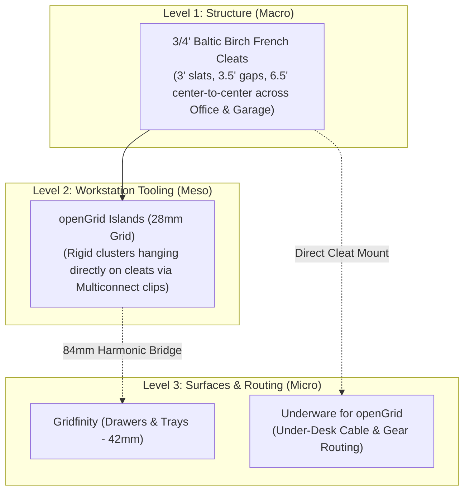

# 📦 Phase 1: Workspace Organization & The Three-Tier Stack

The best way to master your Bambu X2D is by creating practical, modular organization systems for your workspace. Instead of treating your office and garage as separate disconnected worlds, we deploy a **Unified Three-Tier Organization Stack** that standardizes on **3/4" Birch French Cleats** as universal room-scale infrastructure, with **openGrid Islands** on the walls and **Gridfinity / Underware** handling desktop drawers and invisible under-desk cable routing.

---

## 🏛️ The Unified Three-Tier Hierarchy



| Level | Scale | System | Physical Implementation | Role |
| :--- | :--- | :--- | :--- | :--- |
| **Level 1: Structure (Macro)** | Walls (Office & Garage) | **3/4" French Cleats** | 3" slats, 3.5" clear gaps ($6.5"$ center-to-center). Ripped from 3/4" Birch. | Universal room-scale architectural backbone. Single table saw setup. |
| **Level 2: Tooling (Meso)** | Wall Clusters & Focal Zones | **openGrid Islands** | 28mm modular openGrid tiles hanging on cleats via 3D-printed brackets & Multiconnect snaps. | High-density tool & gear zones (calipers, snips, headphones, stream deck). |
| **Level 3: Micro** | Drawers & Under-Desk | **Gridfinity & Underware** | 42mm modular Gridfinity bins inside drawers; Underware for openGrid tiles under desk. | Fine in-drawer sorting and modular under-desk cable/gear routing without re-drilling wood. |

---

## 💡 Why openGrid is the Superior System

After extensive community testing and evolution, **openGrid** (created by David D, released under CC-BY) has emerged as the premier choice over older systems like Multiboard:

1. **True Open Source (CC-BY):** openGrid is genuinely open source, allowing open parametric generators (Tile Generator, Multiconnect accessory builders) without restrictive commercial licensing.
2. **25%–40% Less Filament & Faster Printing:** openGrid utilizes an optimized lattice structure that eliminates unnecessary solid plastic blocks. Tiles slice and print dramatically faster while consuming significantly less PETG spool weight.
3. **The 84mm Harmonic Bridge with Gridfinity:**
   $$\text{openGrid: } 3 \times 28\text{ mm} = 84\text{ mm}$$
   $$\text{Gridfinity: } 2 \times 42\text{ mm} = 84\text{ mm}$$
   Every 3 openGrid cells match exactly 2 Gridfinity bins! This mathematical harmony allows hanging floating Gridfinity trays and shelves directly off openGrid wall islands with perfect alignment and zero fractional overhangs.
4. **Front-Operable Multiconnect Standard:** Accessories lock in firmly from the front side. You never have to reach behind the board or hold a rear nut once the panel is mounted.
5. **Native Underware Integration:** *Hands on Katie's* acclaimed **Underware** cable management ecosystem officially standardized on openGrid, offering refined snap-fit channels and lower profile wire routes.

---

## 🧱 Level 2: openGrid Islands for French Cleats

Instead of screwing openGrid tiles directly into drywall with plastic anchors (which damages walls and bows under heavy loads), we mount them as **rigid, removable cleat-hung islands**.

```
              DUAL-CLEAT openGrid ISLAND (Zero Wobble)
              
                   Wall Studs ──|
                                |  +-------------------+
                    Cleat Row 1 |  | Top Cleat         /
                                |  +---\---------------+
                                |       \  [3D Cleat Clip]
                                |        \   |
                                |         \==+==================+
                                |            |                  |
                    3.5" Gap    |            |  openGrid        |
                                |            |  Tile (28mm Grid)|
                                |            |                  |
                                |  +---------+                  |
                    Cleat Row 2 |  | Mid Cleat /                |
                                |  +---\-----+                  |
                                |       \  [Dual-Cleat Catch]   |  <-- Prevents inward
                                |        \   |                  |      swing when pressing
                                |         \==+==================+      in accessories!
```

### 1. The 3 Essential Hardware Components for openGrid Islands
1. **Dual-Cleat Backer Brackets ($6.5"$ / $168\text{ mm}$ Span):**
   * With a 3" cleat and 3.5" clear gap, row spacing is **$6.5"$ center-to-center ($165.1\text{ mm}$)**.
   * Six openGrid 28mm units span **$168\text{ mm}$ ($6 \times 28\text{ mm}$)**. A 3D-printed cleat bracket with slight vertical slot tolerance ($1.5\text{ mm}$) locks directly across two consecutive cleats.
   * Catching two cleats provides vertical leverage: when pressing Multiconnect accessories in, the bottom cannot swing inward toward the wall.
2. **Bottom Offset Plumb Spacer ($3/4"$ Standoff):**
   * If you hang a small mini island from only a single top cleat, snap a printed **3/4" standoff block** into the bottom openGrid corners. This ensures the island hangs dead plumb against the wall.
3. **Anti-Lift Safety Cam-Locks / M4 Thumbscrews:**
   * In an office, you frequently pull items upward (e.g., lifting headphones or pulling a charging cable). A simple printed cam-lock or M4 thumbscrew under the upper cleat hook locks the island securely so it cannot accidentally jump off the rail.

### 2. Office Aesthetics: Blending Wood & Tech
* Sand your 3/4" Birch cleats to 220 grit, apply a slight 1/8" roundover on exposed edges, and finish with a clear satin polyurethane or hardwax oil (e.g., Rubio Monocoat / Osmo).
* Pair with matte black or charcoal grey PETG openGrid tiles for a clean, Scandinavian modern studio aesthetic.

### 3. Recommended openGrid Slicer Settings
* **Filament:** **PETG** (provides elasticity so Multiconnect snap clips and locking tabs never shear).
* **Walls / Perimeters:** **3 walls**.
* **Infill:** `15%–20% Gyroid`.

---

## 🗄️ Level 3: Gridfinity (Drawers & Desktop Trays)

Created by Zack Freedman, **Gridfinity** is the open-source standard for modular drawer compartmentalization.

```
+-------------------+
|  42mm x 42mm Base |   <-- 1 Unit (1U width/depth)
|  [Magnet] [Magnet]|   <-- 6x2mm magnet holes
+-------------------+
```

* **Grid Unit:** **42 mm x 42 mm** per square.
* **Height Units:** Increments of **7 mm** (3U = 21mm shallow drawer; 6U = 42mm deep bin).
* **Magnets:** Corners accept **6 mm diameter x 2 mm thick** neodymium disc magnets.
* **openGrid Integration:** Because $3 \times 28\text{ mm} = 2 \times 42\text{ mm} = 84\text{ mm}$, you can print a **Multiconnect-to-Gridfinity Docking Shelf** that snaps directly onto your wall openGrid island, giving you a floating dock for small screw bins, calipers, or SD card holders!
* **Filament:** **PLA / PLA+** (crisp details, perfectly flat bases).

---

## 🔌 Level 3: Underware for openGrid (Under-Desk Cable Management)

*Hands on Katie's* **Underware for openGrid** conquers cable chaos beneath desks while preserving your furniture:

### 🔩 The "Screw Once" Under-Desk Foundation
Instead of drilling bespoke screw holes into the underside of your desk every time you acquire a new monitor, laptop dock, or USB hub:

1. **Mount openGrid Inverted Beneath the Desk:**
   * Print 2 to 4 standard **openGrid Core Tiles** in **PETG**.
   * Secure the tiles flat against the underside of the desktop using low-profile **#8 x 1/2" (or 5/8") pan-head wood screws** directly through openGrid's countersunk mounting holes.
   * Space tiles along the rear cable-routing zone or directly beneath your monitor arm mount.
2. **Infinite Modular Reconfiguration:**
   * You only drill into your desk wood **once**.
   * Any future addition—cable clips, power brick cradles, dock sleds—snaps mechanically into the openGrid holes via native Underware clips and Multiconnect fittings.
   * If you rearrange your desk or change computers, unclip and reposition without leaving screw holes in your furniture.

```
                      DESKTOP UNDERSIDE (Cross-Section)
═══════════════════════════════════════════════════════════════════ Desktop Wood
       │ #8x1/2" Pan-Head Screw                    │ #8x1/2" Screw
   ┌───┴───────────────────────────────────────────┴───┐
   │       Inverted openGrid Tile Substrate (PETG)     │ (28mm Grid)
   └─────┬───────────────────────────────────────┬─────┘
         │ Underware Snap Clip                   │ Multiconnect Fitting
   ┌─────┴──────────────┐                  ┌─────┴────────────────┐
   │ Underware Raceway  │ (Cable Routing)  │ Clamping Brick Arm   │ (Power Brick)
   │ [ ⚡ Power / USB ] │                  │ [ 140W Charger Block]│
   └────────────────────┘                  └──────────────────────┘
```

### 🧩 Underware for openGrid Modules
* **Parametric Cable Raceways:** Snap-in J-hooks and spine channels that lock into openGrid 28mm points, keeping thick power cords, DisplayPort cables, and USB-C lines neatly bundled and out of sight.
* **Heavy-Duty Clamping Brick Cradles:** Dual-sided tension arms that firmly squeeze heavy laptop chargers (65W to 240W bricks) and monitor power supplies flush against the underside of the desk to prevent sagging.
* **Thunderbolt Dock & USB Hub Sleds:** Cradles sized for CalDigit TS4, Dell, or Anker docks that permit passive heat dissipation downward while keeping desk surfaces 100% clear.
* **Filament Recommendation:** **PETG** is strictly required here. PLA will experience plastic creep under constant screw torque and clamp tension, causing brackets to loosen over time. PETG flexes indefinitely when popping cables into J-hooks.

---

## 📋 Starter Print Checklist for the Office Stack

- [ ] **Print 1:** 2x **Universal 45° Cleat-to-openGrid Dual-Row Brackets** (6-unit / 168mm span, PETG).
- [ ] **Print 2:** 1x **3/4" Plumb Standoff Spacer** (for single-cleat mini islands).
- [ ] **Print 3:** 1x **Anti-Lift Safety Cam-Lock** (thumbscrew wedge).
- [ ] **Print 4:** openGrid wall tile cluster with Multiconnect headphone hanger and caliper clip (PETG).
- [ ] **Print 5:** Single 1x1 Gridfinity test bin & desk drawer baseplate (PLA+).
- [ ] **Print 6:** 1x Under-Desk openGrid Core Tile (PETG) + Underware for openGrid snap-in cable raceway channel.

---

**Next Step:** Head to [[04 - Phase 2 - Garage & Workshop Tool Organization]] to see how the exact same French cleat rails scale up to heavy Milwaukee power tools.
