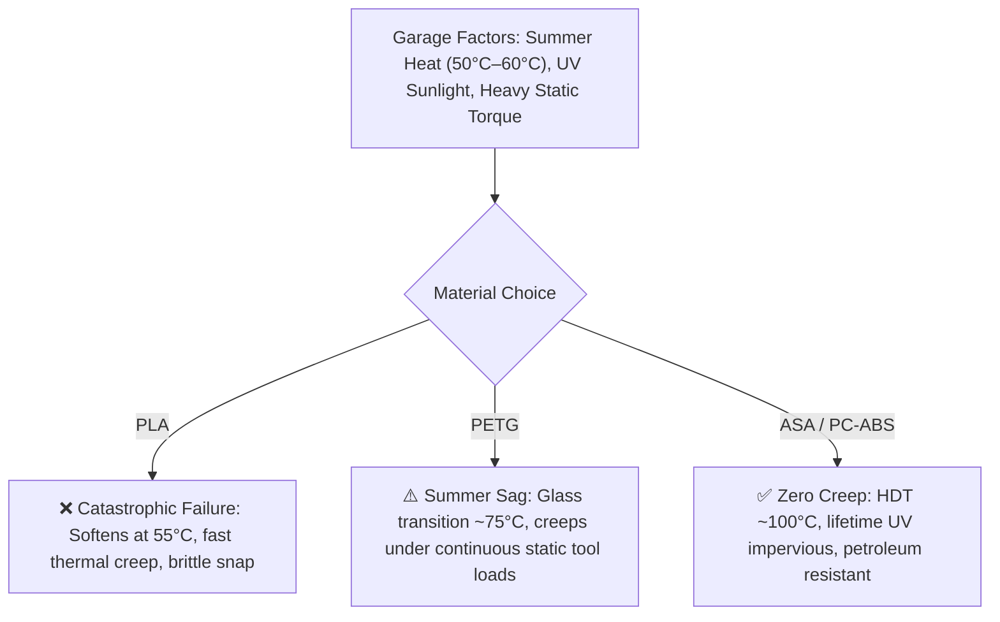
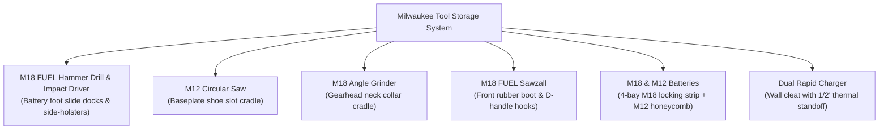
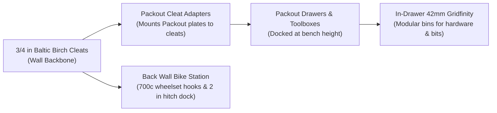

# 🛠️ Phase 2: Garage & Workshop Tool Organization

When moving from desk organizers to garage tool hanging, the mechanical and environmental demands increase drastically. This note covers how to design and print load-bearing, heat-resistant, and impact-proof tool holders using the **Bambu X2D**.

---

## ☀️ The Garage Environment: Why PLA & PETG Struggle



1. **Midwest Garage Heatwaves (Thermal Creep):** In a closed Midwestern summer garage with hot cars parked inside radiating engine heat, ambient temperatures frequently reach **120°F–140°F (50°C–60°C)**.
   * **PLA:** Softens at ~55°C; under the weight of a heavy drill or hammer, it droops and drops tools within weeks.
   * **PETG:** While fine in climate-controlled offices, PETG under **continuous static cantilever load** (e.g. heavy power tool hooks or cleat brackets) experiences subtle long-term **thermal creep** during peak summer heat waves.
   * **ASA (Acrylonitrile Styrene Acrylate):** Heat Deflection Temperature is **~95°C–100°C**. It will never droop, sag, or soften under summer heat.
2. **UV Exposure (Open Garage Doors):** Sun exposure through open overhead doors degrades PETG over time. ASA is chemically engineered for automotive exterior trim and is **100% UV-impervious**—it will never fade, yellow, or embrittle.
3. **Chemical & Solvent Resistance:** Garage tools introduce WD-40, brake cleaner, and motor oil. ASA has high resilience against hydrocarbon oils.

---

## 🎯 Material Strategy for Tool Storage

| Application | Recommended Filament | Key Property & Profile |
| :--- | :--- | :--- |
| **openGrid Workshop Wall Tiles** | **ASA (Full)** ⭐ | **Full profile only** (maximum wall thickness); HDT ~100°C; zero summer sag |
| **Cordless Tool Hangers (Drills, Grinders)** | **PC-ABS** or **ASA** | High rigidity, handles continuous static cantilever torque |
| **Snap-in Wrench/Plier Clips & Living Hinges** | **EZ PA (Nylon)** | High toughness, flexible without fatigue, oil-resistant |
| **French Cleat Brackets & Heavy Rails** | **ASA** | High shear strength, tight mechanical dimensional stability |
| **Battery Mounts & Locking Cradles** | **EZ PA** or **PC-ABS** | Smooth wear resistance, tight snap-retention tabs |
| **Soft Tool Liners & Mallet Bumpers** | **TPU 95A** | Non-marring flexible cushion (feed externally via 4-in-1 PTFE) |

---

## 📐 Structural Slicing Rules for Load-Bearing Parts

```
       WRONG ORIENTATION                 CORRECT ORIENTATION
     (Fails along layer lines)          (Filament strands take load)
     
        Load ⬇                             Load ⬇
       +------+                           +=============+
       |------|  <-- Layer lines shear    |             |  <-- Long perimeters
       |------|                           |             |      absorb tension
       |------|                           +=============+
```

### 1. Orientation is King
* **Tensile Strength vs. Layer Adhesion:** 3D prints are weakest across the Z-axis (between layers).
* **Rule:** Always orient hooks, cleats, and brackets so the load pulls **along the length of the extruded lines**, never pulling the layers apart.

### 2. Walls Beat Infill Every Time
* 6 walls with 25% infill is significantly stronger and more rigid than 2 walls with 80% infill.
* **Recommended for Tool Mounts:**
  * **Walls / Perimeters:** `4 to 6 walls`
  * **Top/Bottom Layers:** `5 to 6 layers`
  * **Infill:** `25–40% Gyroid` (provides uniform multi-directional strength)

### 3. Actively Heated Chamber Settings (X2D)
* **Preheat:** Set the X2D heated chamber to 55–65°C for 15 minutes before printing ASA or PC-ABS.
* **Brim:** Always use a `5–10 mm outer brim` with mouse-ear tabs on sharp corners to prevent lifting.
* **Support Interface:** Use `Support for ABS` in the auxiliary nozzle for clean overhang releases (see [[05 - X2D Dual Extrusion & Support Workflow]]).

---

## 🪵 French Cleat Wall System: 4x8 Birch Plywood Architecture

> [!TIP] Universal Room-Scale Infrastructure
> This exact same French cleat profile (3" slats, 3.5" clear spacing, 6.5" center-to-center) is used in both your **Garage** and your **Office** ([[03 - Phase 1 - Desk Organization (Gridfinity & openGrid)#The Unified Three-Tier Hierarchy|Three-Tier Organization Stack]]).
> * **Single Table Saw Setup:** You set your fence once and cut your story-stick spacer blocks once for your entire property.
> * **Cross-Space Interoperability:** A battery charger rack, parts caddy, or [[03 - Phase 1 - Desk Organization (Gridfinity & openGrid)#Level 2 openGrid Islands for French Cleats|openGrid Island]] can move seamlessly between the garage and the office without altering any mounting hardware.

A French cleat system provides an infinitely reconfigurable wall mounting foundation. Combining **3/4" Baltic Birch plywood wall rails** with **3D-printed tool caddies** creates the ultimate garage workshop setup.

```
       3/4" BIRCH WALL CLEAT (Fixed)           3D-PRINTED TOOL BRACKET (Mating)
           Stud ──|                               |── Tool Body / Caddy
                  |  +-------------+              |
                  |  |             |              |  +-------------+
                  |  |             |              |  |             |
                  |  |    3.0"     /              \  |    3.0"     |
                  |  |    Tall    /  45° Bevel     \ |    Tall     |
                  |  |           /                  \|             |
                  |  +----------+                    +-------------+
                  |
             3.5" |  <-- Clear Spacing (Story Stick)
             Gap  |
                  |  +-------------+
                  |  | Next Cleat  /
```

### 1. Maximizing Yield from a 4x8 Sheet of 3/4" Birch Plywood
* **Sheet Dimensions:** $48" \times 96"$ ($4\text{ ft} \times 8\text{ ft}$), 3/4" thickness.
* **The "Two-for-One" 45° Center Cut Technique:**
  1. Rip the 48" sheet lengthwise into **eight 5.85" wide strips** (each 96" / 8 ft long), accounting for 1/8" table saw blade kerfs ($8 \times 5.85" + 7 \times 0.125" \approx 47.7"$).
  2. Tilt the table saw blade to **$45^\circ$** and rip each 5.85" strip directly down the center.
  3. Each strip immediately yields **two matching 8-foot French cleats** with a 45° beveled top and a 90° square bottom!
  4. **Total Yield:** $8 \text{ strips} \times 2 = \mathbf{16\text{ individual 8-foot cleats}}$ ($\mathbf{128\text{ linear feet}}$ of wall rails from a single sheet!).
  5. **Cleat Height:** Produces cleats measuring **$\sim 2.85" \text{ to } 3.0"$ tall**, providing substantial vertical surface area to drive two structural screws per stud without splitting.

### 2. The 3.5" Spacing Standard & The "Story Stick" Workflow
* **Your Wall Spacing:** **3.5" clear spacing** between cleats.
* **The 3.5" Spacer Block (Story Stick):** Cut a scrap piece of 2x4 or plywood to exactly **3.50" wide**.
* **Zero-Measure Installation:**
  1. Laser-level and screw the bottom base cleat into your wall studs.
  2. Rest your 3.5" spacer block on top of the mounted cleat.
  3. Set the next cleat on top of the spacer, check level, and screw into studs.
  4. Repeat all the way up the wall—guarantees exact 3.5" spacing with zero tape measure errors.
* **Wall Stud Fastening:** Use **two #9 or #10 $\times 2-1/2"$ GRK R4 or Spax Cabinet Screws** per 16" on-center stud (one screw 3/4" from the bottom, one screw 3/4" below the bevel) to completely prevent torque twist.

---

## 🔴 Milwaukee M18 & M12 Tool Storage System

Heavy Milwaukee FUEL tools demand purpose-built 3D-printed mounts printed in **ASA** or **PC-ABS**.



### 1. M18 FUEL Gen 4 Hammer Drill (`2904-20`) & Impact Driver (`2953-20`)
* **Weight Profile:** 6 to 8 lbs each with an XC 5.0 or High Output 6.0Ah battery.
* **Mounting Style:** **Inverted Battery-Foot Slide Docks** mounted directly beneath a French cleat shelf or as modular dual-rail wall cleats. The tool slides in via the battery rails; the motor hangs securely below. Includes 28mm lateral clearance for the `2904-20` AutoStop drill's side handle collar and belt clips.
* *Filament:* **Bambu ASA** (5 walls, 35% Gyroid infill, side-oriented slicing).
* *Mobile Work:* Drop-in 2-tool contoured Gridfinity insert for the middle drawer of the Packout stack.

### 2. M12 FUEL 5-3/8" Circular Saw (`2521-20`)
* **Chassis & Blade:** 3,850 RPM, 5-3/8" blade, 1-5/8" cut depth (full 2x lumber single-pass).
* **Mounting Style:** **Baseplate Shoe Slot Bracket**. A custom cleat caddy cradles the stamped aluminum baseplate horizontally, keeping the blade safely recessed in an enclosed protective channel away from contact.
* *Filament:* **Bambu ASA** (4 walls, 30% Gyroid infill).
* *Mobile Work:* Drop-in contoured foam/Gridfinity tray in the deep bottom drawer of the Packout stack.

### 3. M12 FUEL Jig Saw (`2545-20`)
* **Stroke & Action:** 800–3,000 SPM, tool-less T-shank clamp, 4-position orbital action.
* **Mounting Style:** **Shoe Saddle Cleat Bracket**. Drops onto a low-profile ASA bracket with an integrated front blade guard and a 5-slot T-shank blade organizer in the faceplate.
* *Filament:* **Bambu ASA** (4 walls, 30% Gyroid infill).

### 4. Milwaukee 18" Hybrid Fan (`0821-20`)
* **Airflow & Power:** 2,840 CFM, dual M18 / 120V AC hybrid.
* **Mounting Style:** Dual-purpose: docks into captive stops on the [[../garage-tooling/Shop Air Filter Cart|Shop Air Filter Cart]] for whole-shop MERV 14 air scrubbing, or hangs from an oversized **ASA dual-hook cleat bracket** when stored flat against the back wall.
* *Filament:* **Bambu ASA** (5 walls, 30% Gyroid).

### 5. M18 FUEL 21" Self-Propelled Mower (`2823-20`) & High Output Batteries
* **Chassis:** 36V dual-M18 platform (>55 lbs).
* **Storage Protocol:** Stored vertically folded against the garage wall. Secured via a heavy-duty 3D-printed **ASA cleat strap anchor & cam-buckle bracket** bolted to the top cleat rail to eliminate any tipping hazard.
* *Battery Rotation:* Utilizes two M18 High Output packs (8.0Ah / 12.0Ah) that rotate into shop saws during winter.

### 6. NEXUS™ Dedicated Filter Cleaner (`R44AP253100559B`) & Debris Separator
* **Function:** Enclosed cartridge filter cleaner and cyclonic debris separator for the Packout 6-Gallon Wet/Dry Vacuum.
* **Mounting Style:** 3D-printed **ASA retention cleats** mounted to a 12" Baltic Birch shelf dock adjacent to the dust collection vac station.
* *Filament:* **Bambu ASA** (4 walls, 25% Gyroid).

### 7. M18 & M12 Battery Docks & Rapid Chargers
* **M18 Batteries:** Multi-bay horizontal rail with **EZ PA (Nylon)** retention spring tabs that click into the battery side clips.
* **M12 Batteries:** Cylindrical 3-pack or 4-pack honeycomb caddy that accepts the M12 stalk contacts.
* **M18/M12 Rapid Charger Bracket:** Cleat mount featuring a **1/2" air standoff gap** behind the charger for convective heat dissipation during fast charging cycles.

---

## 🗄️ Milwaukee Packout & Gridfinity Workshop Integration

Bridging Milwaukee Packout drawers and wall mounts with the French cleat infrastructure:



### 1. French Cleat to Packout Wall Mount Adapters
* Fasten standard Milwaukee Packout Wall Mounting Plates onto **3/4" Baltic Birch cleat backers** or print heavy-duty **ASA cleat hooks**.
* Spanning two cleats ($6.5"$ center-to-center) eliminates tilt and supports the full static load of loaded Packout drawers.
* **Mobility:** Drawers dock securely above the workbench during shop work, and detach in seconds to load into your truck.

### 2. In-Drawer Gridfinity for Packout Drawers (Benchtop De-Clutter)
* **Drawer Stack Inventory (Surveyed):**
  1. **Multi-Depth 3-Drawer Tool Box (`#48-22-8447`):** Uneven drawer depths (shallow top, medium middle, deep bottom).
  2. **2-Drawer Tool Box (`#48-22-8442`):** Two deep identical drawers ($\approx 5"$ usable height each).
  3. **One-Drawer Wheeled Dolly Base:** Deep single drawer on heavy-duty rolling casters.
* **The 9x7 Gridfinity Matrix (63 Cells per Drawer):**
  * **Interior Drawer Footprint:** $\approx 16.3" \text{ W} \times 12.5" \text{ D}$ ($414\text{ mm} \times 318\text{ mm}$).
  * **Cell Layout:** **$9\text{ units wide} \times 7\text{ units deep} = \mathbf{63\text{ modular cells}}$** ($378\text{ mm} \times 294\text{ mm}$ active grid $+ 18\text{ mm}$ perimeter side lips to prevent sliding).
  * **Bambu Slicing ($256 \times 256\text{ mm}$ Bed):** Each drawer baseplate is printed in **4 interlocking snap-fit quadrants** (e.g. $5\times 4, 4\times 4, 5\times 3, 4\times 3$).
* **Filament Choice:** **Bambu PETG Basic** (or PETG-CF for high rigidity). UV is shielded inside drawers; PETG provides smooth drop-in gliding and impact resistance.
* **Vertical Height ($U$) Allocation by Drawer:**
  * **Shallow Top Drawer (3-Drawer, $\approx 2.3"$ height):**
    * *Max Bin Height:* **$6U$ ($42\text{ mm}$)**.
    * *Contents:* Precision digital calipers, router collets/wrenches, screwdriver bit blocks, hex keys, utility knife blades.
  * **Medium Middle Drawer (3-Drawer, $\approx 3.5"$ height):**
    * *Max Bin Height:* **$11U$ ($77\text{ mm}$)**.
    * *Contents:* Electrical strippers, ratcheting crimpers, WAGO connector sorting bins, heat shrink assortment, multimeters.
  * **Deep Drawers (3-Drawer Bottom, 2-Drawer & 1-Drawer Dolly, $\approx 4.7"–5.2"$ height):**
    * *Max Bin Height:* **$15U$ to $16U$ ($105\text{ mm}–112\text{ mm}$)**.
    * *Contents:* High-capacity fastener bins (GRK structural screws, pocket screws, drywall anchors), impact socket stands, hole saws, and cordless M12 bare tools.

### 3. Back Wall Bike Shop Station (`bike-shop` synergy)
* **700c Disc Wheelset Wall Hangers:** 3D-printed **ASA** wall cradles holding spare gravel/road wheelsets by the rim or thru-axle, keeping them flat against the wall.
* **2" Hitch Bike Rack Wall Dock:** Heavy-duty French cleat mount holding a **2" square receiver tube** (ASA reinforced with 1/2" grade-8 through-bolts or steel sleeve) to store your heavy aluminum hitch bike rack up off the concrete floor.

---

## 🧰 Step-by-Step Project Logs
* Detailed cutting diagrams and universal cleat adapters: [[Garage - Modular French Cleat Tool System]]
* Milwaukee tool models, slice profiles, and CAD sources: [[Garage - Milwaukee M18 & M12 Tool & Battery Storage]]

---

**Next Step:** Learn how to utilize the dual nozzles on your X2D to print complex overhangs without scarring in [[05 - X2D Dual Extrusion & Support Workflow]], or return to [[00 - 3D Printing Hub]].
