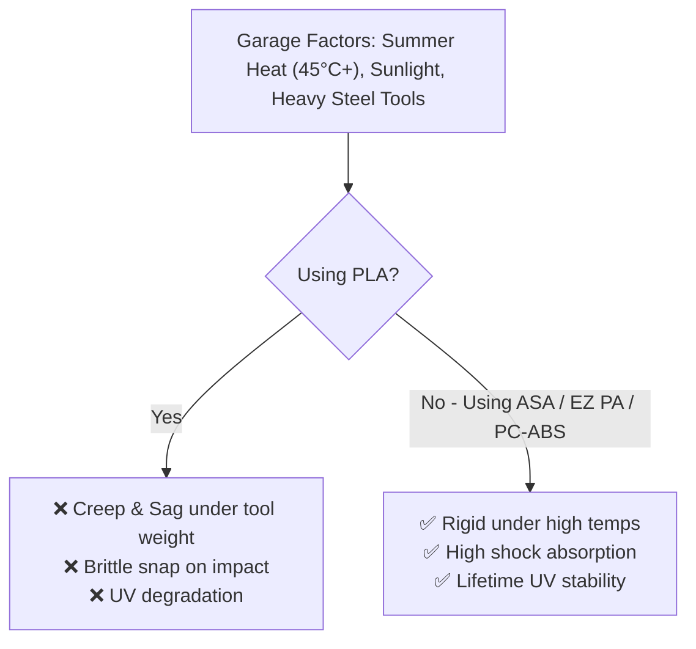
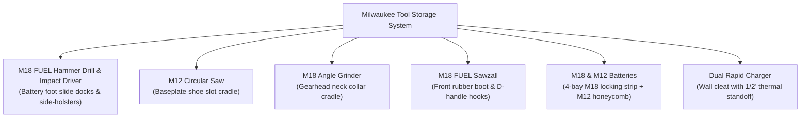

# 🛠️ Phase 2: Garage & Workshop Tool Organization

When moving from desk organizers to garage tool hanging, the mechanical and environmental demands increase drastically. This note covers how to design and print load-bearing, heat-resistant, and impact-proof tool holders using the **Bambu X2D**.

---

## ☀️ The Garage Environment: Why PLA Fails



1. **Thermal Creep:** In a closed summer garage, ambient temperatures can exceed 45°C–50°C. PLA begins to soften at ~55°C and will slowly bend ("creep") under the weight of a drill or hammer until it drops.
2. **Impact & Vibration:** Steel tools repeatedly dropped into plastic clips will shatter brittle plastics.
3. **UV & Chemical Exposure:** Sunlight through open garage doors degrades standard polymers. Garage prints also encounter motor oil, WD-40, and brake cleaner.

---

## 🎯 Material Strategy for Tool Storage

| Application | Recommended Filament | Key Property |
| :--- | :--- | :--- |
| **Cordless Tool Hangers (Drills, Grinders)** | **PC-ABS** or **ASA** | High rigidity, handles continuous static torque load |
| **Snap-in Wrench/Plier Clips & Living Hinges** | **EZ PA (Nylon)** | High toughness, flexible without fatigue, oil-resistant |
| **Wall Tiles, Pegboards & French Cleats** | **ASA** | UV-proof, zero summer sag (HDT ~100°C) |
| **Battery Mounts & Locking Cradles** | **EZ PA** or **PC-ABS** | Smooth wear resistance, tight snap-retention tabs |
| **Soft Tool Liners & Mallet Bumpers** | **TPU 95A** | Non-marring flexible cushion |

---

## 📐 Structural Slicing Rules for Load-Bearing Parts

```
       WRONG ORIENTATION                 CORRECT ORIENTATION
     (Fails along layer lines)          (Filament strands take load)
     
        Load ⬇                             Load ⬇
       +------+                           +=============+
       |------|  <-- Layer lines shear    |             |  <-- Long perimeters
       |------|                           |             |      absorb tension
       |------|                           +=============+
```

### 1. Orientation is King
* **Tensile Strength vs. Layer Adhesion:** 3D prints are weakest across the Z-axis (between layers).
* **Rule:** Always orient hooks, cleats, and brackets so the load pulls **along the length of the extruded lines**, never pulling the layers apart.

### 2. Walls Beat Infill Every Time
* 6 walls with 25% infill is significantly stronger and more rigid than 2 walls with 80% infill.
* **Recommended for Tool Mounts:**
  * **Walls / Perimeters:** `4 to 6 walls`
  * **Top/Bottom Layers:** `5 to 6 layers`
  * **Infill:** `25–40% Gyroid` (provides uniform multi-directional strength)

### 3. Actively Heated Chamber Settings (X2D)
* **Preheat:** Set the X2D heated chamber to 55–65°C for 15 minutes before printing ASA or PC-ABS.
* **Brim:** Always use a `5–10 mm outer brim` with mouse-ear tabs on sharp corners to prevent lifting.
* **Support Interface:** Use `Support for ABS` in the auxiliary nozzle for clean overhang releases (see [[05 - X2D Dual Extrusion & Support Workflow]]).

---

## 🪵 French Cleat Wall System: 4x8 Birch Plywood Architecture

> [!TIP] Universal Room-Scale Infrastructure
> This exact same French cleat profile (3" slats, 3.5" clear spacing, 6.5" center-to-center) is used in both your **Garage** and your **Office** ([[03 - Phase 1 - Desk Organization (Gridfinity & Multiboard)#The Unified Three-Tier Hierarchy|Three-Tier Organization Stack]]).
> * **Single Table Saw Setup:** You set your fence once and cut your story-stick spacer blocks once for your entire property.
> * **Cross-Space Interoperability:** A battery charger rack, parts caddy, or [[03 - Phase 1 - Desk Organization (Gridfinity & Multiboard)#Level 2 Multiboard Islands for French Cleats|Multiboard Island]] can move seamlessly between the garage and the office without altering any mounting hardware.

A French cleat system provides an infinitely reconfigurable wall mounting foundation. Combining **3/4" Baltic Birch plywood wall rails** with **3D-printed tool caddies** creates the ultimate garage workshop setup.

```
       3/4" BIRCH WALL CLEAT (Fixed)           3D-PRINTED TOOL BRACKET (Mating)
           Stud ──|                               |── Tool Body / Caddy
                  |  +-------------+              |
                  |  |             |              |  +-------------+
                  |  |             |              |  |             |
                  |  |    3.0"     /              \  |    3.0"     |
                  |  |    Tall    /  45° Bevel     \ |    Tall     |
                  |  |           /                  \|             |
                  |  +----------+                    +-------------+
                  |
             3.5" |  <-- Clear Spacing (Story Stick)
             Gap  |
                  |  +-------------+
                  |  | Next Cleat  /
```

### 1. Maximizing Yield from a 4x8 Sheet of 3/4" Birch Plywood
* **Sheet Dimensions:** $48" \times 96"$ ($4\text{ ft} \times 8\text{ ft}$), 3/4" thickness.
* **The "Two-for-One" 45° Center Cut Technique:**
  1. Rip the 48" sheet lengthwise into **eight 5.85" wide strips** (each 96" / 8 ft long), accounting for 1/8" table saw blade kerfs ($8 \times 5.85" + 7 \times 0.125" \approx 47.7"$).
  2. Tilt the table saw blade to **$45^\circ$** and rip each 5.85" strip directly down the center.
  3. Each strip immediately yields **two matching 8-foot French cleats** with a 45° beveled top and a 90° square bottom!
  4. **Total Yield:** $8 \text{ strips} \times 2 = \mathbf{16\text{ individual 8-foot cleats}}$ ($\mathbf{128\text{ linear feet}}$ of wall rails from a single sheet!).
  5. **Cleat Height:** Produces cleats measuring **$\sim 2.85" \text{ to } 3.0"$ tall**, providing substantial vertical surface area to drive two structural screws per stud without splitting.

### 2. The 3.5" Spacing Standard & The "Story Stick" Workflow
* **Your Wall Spacing:** **3.5" clear spacing** between cleats.
* **The 3.5" Spacer Block (Story Stick):** Cut a scrap piece of 2x4 or plywood to exactly **3.50" wide**.
* **Zero-Measure Installation:**
  1. Laser-level and screw the bottom base cleat into your wall studs.
  2. Rest your 3.5" spacer block on top of the mounted cleat.
  3. Set the next cleat on top of the spacer, check level, and screw into studs.
  4. Repeat all the way up the wall—guarantees exact 3.5" spacing with zero tape measure errors.
* **Wall Stud Fastening:** Use **two #9 or #10 $\times 2-1/2"$ GRK R4 or Spax Cabinet Screws** per 16" on-center stud (one screw 3/4" from the bottom, one screw 3/4" below the bevel) to completely prevent torque twist.

---

## 🔴 Milwaukee M18 & M12 Tool Storage System

Heavy Milwaukee FUEL tools demand purpose-built 3D-printed mounts printed in **ASA** or **PC-ABS**.



### 1. M18 FUEL Hammer Drill & Impact Driver
* **Weight Profile:** 6 to 8 lbs each with an XC 5.0 or High Output 6.0Ah battery.
* **Mounting Style:** **Inverted Battery-Foot Slide Docks** mounted directly beneath a French cleat shelf, or **Vertical Side Holsters**. The tool slides in via the battery rails; the motor hangs securely below.
* *Filament:* **ASA** (5 walls, 35% Gyroid infill).

### 2. M12 Circular Saw (5-3/8" / 5-1/2")
* **Mounting Style:** **Baseplate Shoe Slot Bracket**. A custom cleat caddy holds the stamped aluminum baseplate horizontally, keeping the blade safely enclosed and recessed away from accidental contact.
* *Filament:* **ASA** (4 walls, 30% Gyroid).

### 3. M18 Angle Grinder (4-1/2" / 5")
* **Challenge:** Heavy cast-aluminum head, protruding wheel guard, and auxiliary handle.
* **Mounting Style:** **Neck Collar Cradle**. A semi-circular U-yoke supports the metal gearbox neck just behind the spindle, allowing the grinder to hang vertically with the guard and handle attached.
* *Filament:* **PC-ABS** or **ASA** (6 walls, 40% Gyroid infill for high static torque).

### 4. M18 FUEL Sawzall (Reciprocating Saw)
* **Mounting Style:** **Dual-Point Horizontal Cradle**. Supports the front rubber nose boot on one bracket and cradles the rear D-handle on a second bracket. Keeps the long blade flat against the wall.
* *Filament:* **ASA** (5 walls, 30% Gyroid).

### 5. M18 & M12 Battery Docks & Rapid Chargers
* **M18 Batteries:** Multi-bay horizontal rail with **EZ PA (Nylon)** retention spring tabs that click into the battery side clips.
* **M12 Batteries:** Cylindrical 3-pack or 4-pack honeycomb caddy that accepts the M12 stalk contacts.
* **M18/M12 Rapid Charger Bracket:** Cleat mount featuring a **1/2" air standoff gap** behind the charger for convective heat dissipation during fast charging cycles.

---

## 🧰 Step-by-Step Project Logs
* Detailed cutting diagrams and universal cleat adapters: [[Garage - Modular French Cleat Tool System]]
* Milwaukee tool models, slice profiles, and CAD sources: [[Garage - Milwaukee M18 & M12 Tool & Battery Storage]]

---

**Next Step:** Learn how to utilize the dual nozzles on your X2D to print complex overhangs without scarring in [[05 - X2D Dual Extrusion & Support Workflow]], or return to [[00 - 3D Printing Hub]].
