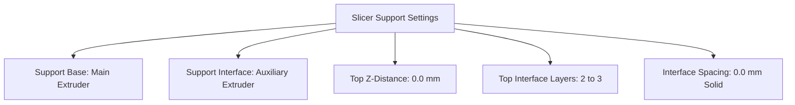

# 🎭 X2D Dual Extrusion & Support Workflow

One of the standout features of the **Bambu X2D** is its dual independent nozzle architecture. This allows you to print complex functional geometries with overhangs, internal channels, and bolt counter-bores that produce **injection-molded smooth bottom surfaces**.

---

## 🔬 The Science of "Zero-Gap" Support Interfaces

```
STANDARD SINGLE NOZZLE (0.2mm Gap)        X2D DUAL NOZZLE (0.0mm Zero-Gap)
+-------------------------------+         +-------------------------------+
|         Printed Model         |         |         Printed Model         |
+-------------------------------+         +-------------------------------+
       ~0.2mm Air Gap (Rough)             | Interface Layer (No Weld)     | <-- Smooth!
=================================         =================================
|      Same Material Support    |         | Base Support (Main Filament)  |
+-------------------------------+         +-------------------------------+
```

* **The Single-Material Problem:** When printing with one material, the slicer leaves an air gap (0.2 mm) so the support doesn't melt into the part. This results in saggy, rough, or scarred overhangs.
* **The Dual-Material Solution:** By choosing two plastics that **do not chemically weld together**, the auxiliary nozzle can print the support interface directly touching the model (**0.0 mm Z-distance**). Once cooled, the supports pop away effortlessly, leaving a glass-smooth surface.

---

## 🗺️ Material Pairing Cheat Sheet (From X2D Field Guide)

| Main Nozzle (Model Material) | Aux Nozzle (Support Interface) | Release Characteristics |
| :--- | :--- | :--- |
| **EZ PA (Nylon)** | **Support for ABS** | Snaps away cleanly, perfectly flat bridge surfaces |
| **ASA** | **Support for ABS** | Zero adhesion to ABS interface, crystal clean finish |
| **PC-ABS** | **Support for ABS** | Effortless breakaway release |
| **PA12-CF & PA6-GF** | **Support for ABS** | Clean separation on fiber parts |
| **PA6-CF** | **ASA Filament** | ASA acts as the ideal non-stick barrier for PA6-CF |
| **PC (Polycarbonate)** | **ASA** or **Support for ABS** | ASA leaves cleanest interface; Support for ABS releases easiest |
| **PLA** | **Support for PLA** or **PETG** | PETG does not weld to PLA |
| **PETG** | **Support for PETG** or **PLA** | PLA does not weld to PETG |

---

## ⚙️ Slicer Configuration Guide (Bambu Studio / OrcaSlicer)

To save expensive specialty support material, configure your slicer to only use the auxiliary nozzle for the **interface layers** (the 2–3 layers directly touching the part), while using standard model filament for the bulk support towers.



### Step-by-Step Settings:
1. **Extruder Assignment:**
   * `Extruder 1 (Main)`: Set to Model Filament (e.g., ASA).
   * `Extruder 2 (Auxiliary)`: Set to Interface Filament (e.g., Support for ABS).
2. **Support Tab Settings:**
   * **Enable Support:** Checked (Tree or Normal).
   * **Support Base Filament:** `Extruder 1 (Main)` (Saves money and toolhead swaps).
   * **Support Interface Filament:** `Extruder 2 (Auxiliary)`.
   * **Top Z-Distance:** `0.0 mm` *(Crucial for zero gap)*.
   * **Bottom Z-Distance:** `0.0 mm`.
   * **Top Interface Layers:** `2` or `3`.
   * **Top Interface Spacing:** `0.0 mm` (Creates a continuous solid support roof).

---

## 💡 Practical Examples for Garage Prints

* **Under-shelf Drill Mounts:** Print horizontal slide rails with 0.0mm support interface so drills slide in like butter without sanding.
* **Threaded Bolt Bosses in Multiboard:** Overhanging screw sockets print with crisp internal threads.
* **Cantilever Tool Hooks:** Heavy tool brackets print flat with curved overhang supports that pop right off.

---

**Next Step:** Review [[06 - Print Troubleshooting & Maintenance]] for common print anomalies and maintenance procedures.
