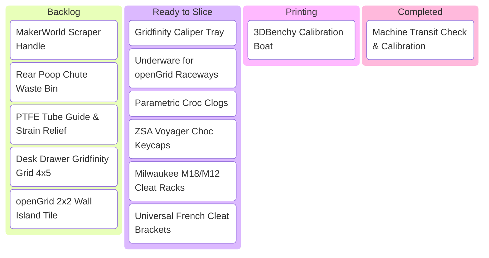

# 📋 Print Queue & Project Tracker

Use this centralized dashboard to prioritize what to print, track items through slicing and production, and maintain a history of your successful builds.

---

## 🚦 Kanban / Status Overview

---

## 🎯 High-Priority Print Queue

### 🏁 Tier 0: Machine Setup & First-Day Essentials
Print these before anything else to upgrade your printer workflow and protect your setup:

- [ ] **Bambu Scraper Handle** — Uses the scraper blade included in your accessories box. [[Starter Project - Bambu Scraper & Poop Chute Bin|Project Log]]
  - *Filament:* PLA or PETG (2 walls, 15% infill)
- [ ] **Rear Poop Chute Bin** — Catches purged filament beads ejected out the back so they don't pile up on your table.
  - *Filament:* PLA or PETG
- [ ] **PTFE Tube Arc Guide** — Relieves strain where the Bowden tube enters the top glass lid / toolhead.
  - *Filament:* PETG or PLA+
- [ ] **Low-Friction 608-Bearing External Spool Roller** — Essential for flexible TPU feeding to eliminate spool drag and prevent filament stretching. Uses 4x 608-2RS skate bearings.
  - *Filament:* PLA or PETG (3 walls, 20% Gyroid)
- [ ] **Silica Desiccant Spool Center Inserts** — Fits into the core of filament spools inside your dry boxes.
  - *Filament:* PETG or ABS

---

### 🖥️ Tier 1: Phase 1 Workspace Organization (Desk & Cables)
See [[03 - Phase 1 - Desk Organization (Gridfinity & openGrid)]] for system details:

#### Gridfinity (Drawers & Desktop)
- [ ] **Test 1x1 Bin (42x42mm)** — Verify magnet press-fit and perimeter tolerances.
- [ ] **Primary Desk Drawer Baseplate** — Sliced in draft mode (`0.28 mm`).
- [ ] **Digital Caliper Cradle Bin (1x4 or 1x5)** — Keeps calipers safe and easily accessible.
- [ ] **Pen & Sharpie Organizer Bin (1x2)**.
- [ ] **USB Drive / SD Card Storage Bin**.

#### openGrid French Cleat Islands (Office Focal Zones)
*Architecture:* [[03 - Phase 1 - Desk Organization (Gridfinity & openGrid)#Level 2 openGrid Islands for French Cleats|openGrid Islands Guide]]
- [ ] **Dual-Cleat openGrid Backer Brackets** (2x brackets spanning 6-units / 168mm across two cleats, PETG).
- [ ] **3/4" Bottom Plumb Standoff Spacers** (Snaps into openGrid corners for single-cleat mini islands).
- [ ] **Anti-Lift Thumbscrew Cam-Locks** (Locks island when pulling upward on cords/headphones).
- [ ] **openGrid Core Tile Cluster** (PETG, 3 walls, 20% Gyroid).
- [ ] **Multiconnect Headphone Hanger Arm & Caliper Cradle**.
- [ ] **openGrid Cable Drop Clips**.

#### Underware for openGrid (Under-Desk Cable & Gear Routing)
*Architecture:* [[03 - Phase 1 - Desk Organization (Gridfinity & openGrid)#Level 3 Underware for openGrid Under-Desk Cable Management|Underware for openGrid Guide]]
- [ ] **Under-Desk openGrid Substrate Tiles** (2–4x Core Tiles, PETG, mounted with #8x1/2" pan-head wood screws).
- [ ] **Underware for openGrid Snap-in Cable Raceways & J-Hooks** (PETG, clips into 28mm openGrid holes).
- [ ] **openGrid Clamping Power Brick Cradles** (Custom-fit dual-arm clamps for laptop chargers).
- [ ] **Under-Desk Dock & USB Hub Sleds** (PETG, 4 walls, passive airflow clearance).

#### Office Acoustic Wall & Bike Gear Station (House DIY Integration)
*Architecture:* `house-diy/office/Office Acoustic Treatment & Workstation Upgrade.md`
- [ ] **Sonolok 21mm Outlet Depth Extension Collars** (Black PETG, flush faceplate fit).
- [ ] **Slat-Lock Cam Brackets** (Matte Black PETG-CF, non-destructive clip-in to Sonolok slats).
- [ ] **Aero Cycling Helmet Wall Cradles** (Matte Black PETG-CF, fits French cleat rail).
- [ ] **Cycling Shoe Cleat Docks** (Look Keo & Shimano SPD-SL 3-bolt / SPD 2-bolt retention).
- [ ] **Optics & Sunglasses Magnetic Dock** (Matte Black PETG-CF, dual-pair shelf).
- [ ] **openGrid Ride-Prep Cartridge Tiles** (Full profile Matte Black PETG, 28mm cells).

---

### 🛠️ Tier 2: Phase 2 Workshop & Garage Tool Storage
See [[04 - Phase 2 - Garage & Workshop Tool Organization]] for engineering rules and the 4x8 birch cut plan:

#### 🪵 French Cleat Infrastructure (3/4" Birch Plywood & ASA)
*Project Log:* [[Garage - Modular French Cleat Tool System]]
- [ ] **Ripping 4x8 Birch Sheet:** 8 strips @ 5.85" wide $\rightarrow$ 45° center split into 16 cleats (128 linear feet).
- [ ] **Wall Installation:** 3.5" clear spacing story-stick spacer; 2x Spax #9x2.5" screws per 16" stud.
- [ ] **Universal 45° Cleat Backplates** (Bambu ASA, 5 walls, 35% Gyroid, side-print orientation).
- [ ] **Anti-Lift Safety Cam-Locks** (Thumbscrew wedge prevents accidental lift-out).
- [ ] **French Cleat to openGrid Adapter Brackets** (Mounts openGrid tiles to cleats).

#### 🔴 Milwaukee FUEL M18 & M12 Tool Storage System
*Project Log:* [[Garage - Milwaukee M18 & M12 Tool & Battery Storage]]
- [ ] **M18 Hammer Drill & Impact Driver Dual Slide Dock** (ASA, inverted battery foot channels).
- [ ] **M12 Circular Saw Baseplate Shoe Bracket** (ASA, enclosed blade safety slot).
- [ ] **M18 Angle Grinder Spindle Neck Collar** (PC-ABS / ASA, clears wheel guard & side handle).
- [ ] **M18 FUEL Sawzall Two-Piece Horizontal Cradle** (ASA, front boot & rear D-handle saddles).
- [ ] **M18 4-Bay Battery Locking Cleat Strip** (ASA frame + EZ PA Nylon spring retention tabs).
- [ ] **M12 4-Bay Cylindrical Honeycomb Battery Caddy** (Deep terminal-protecting sockets).
- [ ] **M18/M12 Dual Rapid Charger Cleat Mount** (1/2" convective air gap + cord wrap).

#### 🗄️ Milwaukee Packout & Gridfinity Integration
*Project Log:* [[04 - Phase 2 - Garage & Workshop Tool Organization#Milwaukee Packout & Gridfinity Workshop Integration|Packout Integration]]
- [ ] **French Cleat to Packout Wall Mount Adapters** (Heavy ASA dual-cleat hooks to mount Packout wall plates).
- [ ] **Packout 9x7 Gridfinity Baseplates (6 Drawers Total)**:
  - [ ] 3x Baseplates for Multi-Depth 3-Drawer (`#48-22-8447`) — 4 snap-fit quadrants per drawer (PETG).
  - [ ] 2x Baseplates for 2-Drawer (`#48-22-8442`) — 4 snap-fit quadrants per drawer (PETG).
  - [ ] 1x Baseplate for 1-Drawer Wheeled Dolly Base — 4 snap-fit quadrants (PETG).
- [ ] **Top Shallow Drawer 6U Bins** (Digital caliper tray, router collet rack, hex bit blocks).
- [ ] **Middle Drawer 11U Bins** (Electrical strippers, crimpers, WAGO compartment trays).
- [ ] **Deep Drawer 15U/16U Bins** (High-capacity fastener bins for GRK cabinet screws, pocket screws).

#### 🚲 Back Wall Bike Shop Station (`bike-shop` synergy)
- [ ] **700c Disc Wheelset Cleat Hangers** (ASA wall cradles holding wheels flat by rim/axle).
- [ ] **2" Hitch Bike Rack Wall Cleat Dock** (Heavy-duty reinforced ASA cradle + steel sleeve for 1UP/Kuat rack).

---

### 👟 Tier 3: 3D Printed Footwear & Wearables (TPU & Foaming TPU)
See [[09 - 3D Printed Footwear (Sneakers, Clogs & TPU)]] for material rules, sizing calculations, and AMS bypass:

- [ ] **Parametric Croc-Style Clogs** — Single-piece monocoque clog with ventilation ports. [[Footwear - Parametric Croc-Style Clogs|Project Log]]
  - *Filament:* TPU 95A or ColorFabb varioShore Foaming TPU (3 walls, 12% Gyroid)
  - *Setup:* External spool holder (bypass AMS), diagonal bed placement, textured PEI with glue stick.
- [ ] **Casual Thick-Sole Slides (Whaleberry / Air Slides)**
  - *Filament:* Foaming TPU for ultra-cushioned footbed.
- [ ] **Barefoot / Minimalist Walking Shoes (Tora / Mirai)**
  - *Filament:* TPU 85A or TPU 95A (thin sole, wide toe box).
- [ ] **Lattice Running Sneaker Midsole**
  - *Filament:* TPU 95A outsole + Foaming TPU lattice midsole.

---

### ⌨️ Tier 4: Precision 0.2mm Printing & Mechanical Keyboards
See [[10 - Precision Printing & ZSA Voyager Keycaps (0.2mm Nozzle)]] for stem geometry, sequential slicing, and 0.2mm nozzle calibration:

- [ ] **ZSA Voyager Ergonomic Choc Set (52 Keys)** — Custom *KLP Lamé* or *Chicago Steno* scooped caps. [[Keycaps - ZSA Voyager Ergonomic Choc Set|Project Log]]
  - *Nozzle:* **0.2 mm Hardened Steel** (resolves 0.55mm stem prongs)
  - *Filament:* PETG Basic (Black body + White/Cyan legends)
  - *Slicer Settings:* `0.08 mm` layer height, 4 walls, 100% solid infill, **Print by Object** (sequential), micro-fuzzy skin (`0.06mm / 0.10mm`).
- [ ] **Tactile Homing Marker Caps (F and J)** — Pronounced index-finger orientation ridges.
- [ ] **Voyager Ergonomic Thumb Fan Cluster** — Angled, low-fatigue space/enter thumb keys.

---

## 🗂️ Project Log Directory

Whenever you start a complex or multi-part build, create a new note in your `Projects/` folder using `Templates/Template - Print Project Log.md`.

| Project Name | Primary Filament | Status | Notes Link |
| :--- | :--- | :--- | :--- |
| **Bambu Scraper & Poop Bin** | PLA / PETG | 🟡 Queued | [[Starter Project - Bambu Scraper & Poop Chute Bin]] |
| **Modular French Cleat System** | 3/4" Birch + ASA | 🟡 Ready to Build | [[Garage - Modular French Cleat Tool System]] |
| **Milwaukee M18 & M12 Storage** | ASA / EZ PA Nylon | 🟡 Ready to Slice | [[Garage - Milwaukee M18 & M12 Tool & Battery Storage]] |
| **Parametric Croc Clogs** | TPU 95A / Foaming TPU | 🟡 Ready to Slice | [[Footwear - Parametric Croc-Style Clogs]] |
| **ZSA Voyager Choc Keycaps**| PETG Basic (0.2mm nozzle) | 🟡 Ready to Slice | [[Keycaps - ZSA Voyager Ergonomic Choc Set]] |
| *Drawer Gridfinity Overhaul* | PLA Black | ⚪ Idea | — |
| *Office openGrid Wall* | PETG Grey | ⚪ Idea | — |

---

**Back to Top:** [[00 - 3D Printing Hub]]
