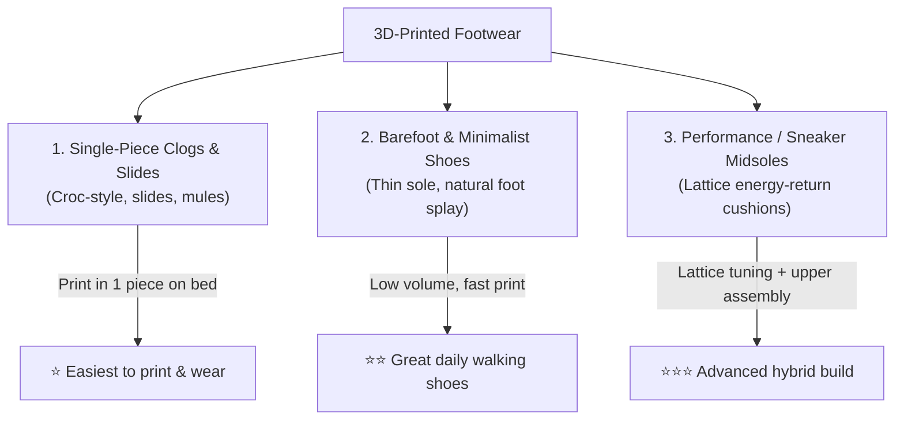
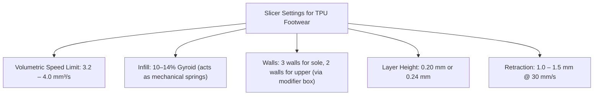

# 👟 3D Printed Footwear: Sneakers, Clogs & Flexible TPU

Printing your own custom footwear at home is one of the most exciting frontiers of 3D printing. With modern direct-drive extruders and advanced flexible polymers, you can produce fully wearable, ergonomic shoes—from slip-on clogs to shock-absorbing running shoe midsoles.

---

## 🥾 Types of 3D-Printed Footwear



### 1. Single-Piece Slip-On Clogs & Slides
* **Best Models:** *Crocs Shoes - Fully 3D-printed* (MakerVerse), *CROCK CLOGS*, *Whaleberry* slides, *Air Slides*.
* **Characteristics:** The entire shoe (outsole, footbed, vamp, and heel cup) prints as a single monocoque object directly on the build plate.
* **Wearability:** High comfort for house slippers, garden shoes, beach slides, and casual walking.

### 2. Barefoot & Minimalist Shoes
* **Best Models:** *Tora*, *G0*, and *Mirai* Barefoot Shoes (by *川* on MakerWorld).
* **Characteristics:** Wide anatomical toe box, zero-drop heel-to-toe angle, and a flexible, thin sole that allows natural foot articulation and ground feedback.
* **Why 3D Print Them:** Commercial barefoot shoes cost \$120–\$180; a 3D-printed pair uses roughly \$12–\$18 worth of TPU filament.

### 3. Running Sneaker Midsoles (Lattice Foam Replacement)
* **How It Works:** Traditional running shoes use chemically expanded EVA foam (which degrades and compresses over 300–500 miles). 3D printing replaces foam with **generative lattice structures** (like Adidas 4D or custom Gyroid lattices) that absorb impact and return kinetic energy.
* **Hybrid Construction:** Print the lattice midsole and outsole in TPU, then bond a breathable knit fabric upper or print a flexible TPU sock liner.

---

## 🧪 Material Selection: Finding the Right Shore Hardness

The flexibility of rubber-like filaments is measured on the **Shore Hardness scale** (e.g., 95A, 85A, 70A).

```
Stiff Plastic <---------------------------------------------------> Rubber Band
     PLA / PETG          TPU 95A         TPU 85A       Foaming TPU (Expanded)
   (Too hard/cracks)   (Outsoles)      (Midsole)       (EVA Shoe Foam feel)
```

| Material | Shore Hardness | Elasticity | Best Shoe Component | Notes |
| :--- | :--- | :--- | :--- | :--- |
| **Bambu TPU 95A / 95A HF** | 95A (Semi-flexible) | Firm, springy | Outsoles, high-wear treads, clog frames | Prints easily and reliably on Bambu direct-drive extruders. |
| **TPU 85A / 80A** | 80A–85A (Flexible) | Soft, shock-absorbing | Insoles, slide straps, barefoot uppers | Highly pliable; must be printed slowly to avoid toolhead jams. |
| **Foaming TPU (varioShore / LW-TPU)** | Dynamically foams from 80A down to 60A | Extremely plush, spongy | Midsoles, cushioning pads, cloud-like clogs | **The holy grail for shoe printing.** Contains a heat-activated blowing agent that expands at 230–250°C, lowering density by 40–50% to create true EVA-style foam. |

---

## ⚠️ Critical Machine Setup for Bambu X2D

Printing flexible TPU requires a few hardware adaptations to prevent jamming, extruder starvation, bed damage, and moisture degradation:

```
                  EXTERNAL TPU FEEDING ARCHITECTURE
                  
  [ Active Heated Dry Box ] 
           OR                ──► [ PTFE Tube (2.5mm ID) ] ──┐
  [ 608-Bearing Roller ]                                    │
                                                            ▼
  [ AMS 2 Pro (Rigid Filaments) ] ────────────────────────► [ Bambu 4-in-1 Adapter ] 
                                                                    │
                                                                    ▼
                                                            [ Printer Rear Inlet ]
                                                                    │
                                                                    ▼
                                                            [ Toolhead Extruder ]
```

### 1. The AMS Bypass & The Bambu 4-in-1 PTFE Adapter
* **Why TPU Fails in AMS:** Standard TPU (95A, 85A, Foaming) is too pliable for the motorized feed funnels, selector wheels, and long Bowden paths of the AMS or AMS 2 Pro. It bends, kinks, and wraps around internal feed rollers.
* **The Solution:** Always feed TPU from an **external spool** directly into the printer.
* **The 4-in-1 Adapter Trick:** Without an adapter, switching between AMS prints (PLA/PETG) and external TPU requires manually unplugging the Bowden tube from the rear buffer, which wears out collets. Installing the official **Bambu 4-in-1 PTFE Adapter** (~$5) at the rear inlet allows both your AMS line and your external TPU feed tube to **remain permanently connected**.

### 2. Eliminating Tensile Drag (The "Rubber Band" Effect)
Unlike rigid PLA, **TPU behaves like an elastic band under tension**:
* If the spool sits on a stationary peg with rotational friction, or if the PTFE tube has sharp bends, the extruder motor has to yank the rubbery filament.
* This tension **stretches the filament thin** before it reaches the drive gears. Once extruded, the reduced volume creates severe under-extrusion, layer gaps, and brittle, hollow shoe soles.
* **Two Solutions to Eliminate Drag:**
  1. **Print a Ball-Bearing Roller:** Print a spool caddy using four standard **608-2RS ball bearings** (Amazon $6 pack). The spool rolls with near-zero drag, letting the direct-drive extruder pull filament effortlessly.
  2. **Feed Directly from an Active Heated Dry Box:** Mount the spool inside a heated dryer (Sunlu S2, Sovol SH01) sitting beside or behind the printer, running a short PTFE tube straight to the 4-in-1 adapter.

### 3. Moisture Control for 12–20 Hour Shoe Prints
* TPU is exceptionally hygroscopic—it begins absorbing atmospheric moisture within 2–4 hours of unsealed exposure.
* **Symptoms of Wet TPU:** Sputtering/popping sounds at the hotend, fine hairy stringing across clog vent holes, and poor layer lamination.
* **Protocol:**
  * Pre-dry the spool at **55°C for 6 to 8 hours** before slicing.
  * Because single-piece shoes take **12 to 20 hours** to print, printing directly out of an active heated dry box prevents ambient room humidity from ruining the upper half of the shoe.

### 4. Build Plate Protection (Release Agent Strictly Required)
> [!CAUTION] TPU Will Weld Permanently to Clean PEI!
> TPU has an extraordinary chemical affinity for PEI. If printed onto a bare, clean PEI plate, **it will fuse to the bed and tear the PEI coating completely off the spring steel sheet** when you attempt to remove the shoe!
> * **Mandatory Rules:**
>   1. Use a **Dual-Sided Textured PEI Plate** (microscopic texture provides mechanical release valleys).
>   2. Apply a thin, uniform layer of **Bambu Liquid Glue or standard glue stick** over the entire printing area. The glue functions as a **sacrificial release barrier**, enabling the cooled shoe to pop off with gentle flexing.

---

## 📐 Sizing, Fit & Build Plate Orientation

### 1. Foot Measurement to Slicer Scale Factor
1. Place a piece of paper against a flat wall on a hard floor.
2. Step onto the paper with your heel firmly touching the wall.
3. Mark the tip of your longest toe with a pencil held vertically.
4. Measure the distance in millimeters ($L_{\text{foot}}$).
5. **Add Comfort Allowance:** Add **7 to 10 mm** to $L_{\text{foot}}$ for clogs and casual shoes (e.g., a 270 mm foot needs a 278 mm internal shoe cavity).
6. **Slicer Scaling Formula:**
   $$\text{Scale Factor (\%)} = \left(\frac{\text{Target Shoe Length (mm)}}{\text{Model Default Length (mm)}}\right) \times 100$$

### 2. Fitting Shoes on the 256 × 256 mm Build Plate
The Bambu X2D build volume is $256 \times 256 \times 260\text{ mm}$.
* Shoe lengths up to ~250 mm (US Men's 7 / EU 40) fit straight along the Y-axis.
* For larger shoe sizes (US Men's 8 to 13 / EU 41 to 47, which measure 260 mm to 305 mm long), place the shoe **diagonally across the build plate**:
  $$\text{Diagonal Bed Clearance} = \sqrt{256^2 + 256^2} \approx 362\text{ mm}$$
  Rotating the shoe $45^\circ$ unlocks up to **360 mm of length**, easily fitting adult shoe sizes!

---

## ⚙️ Golden Slicer Settings for Shoes (Bambu Studio / OrcaSlicer)



1. **Max Volumetric Speed:** Lower the filament profile's `Max Volumetric Speed` to **$3.5\text{ mm}^3/\text{s}$**. This automatically slows the printer down on long straightaways to prevent extruder skipping on rubber.
2. **Gyroid Infill for Cushioning:** Unlike rigid infills, **Gyroid infill acts like a cluster of micro coil springs**. When stepped on, the alternating curved waves compress under weight and spring back, creating natural heel shock absorption.
3. **Density Modifier Boxes:**
   * Under the heel: Add a slicer modifier box set to **$18–22\%$ Gyroid infill** (firms up heel strike).
   * Under the midfoot/arch: Set to **$12–14\%$ Gyroid**.
   * Under the forefoot: Set to **$8–10\%$ Gyroid** (allows effortless natural toe flexion).
4. **Wall Loops:** Use **3 to 4 walls** for the sole (abrasion and puncture resistance) and **2 walls** for the upper shoe (soft and pliable around the instep).

---

## 🚀 The Bambu X2D Dual-Nozzle Footwear Advantage

The dual independent nozzles of the **Bambu X2D** enable advanced footwear manufacturing techniques that single-nozzle printers cannot achieve:

```
+-------------------------------------------------------+
|  Extruder 2 (Aux): Foaming TPU (Plush, soft cushion)  |  <-- Midsole & Insole
+=======================================================+
|  Extruder 1 (Main): TPU 95A (Hard, abrasion-resistant)|  <-- Outsole / Tread
+-------------------------------------------------------+
```

1. **Dual-Density Soles:**
   * **Extruder 1 (Main):** Tough, wear-resistant **TPU 95A** for the outer tread pattern in contact with pavement.
   * **Extruder 2 (Auxiliary):** Soft, expanded **Foaming TPU (varioShore)** for the midsole and footbed.
2. **Zero Purge Waste:** Because the X2D uses two separate hotends, switching between hard outsole and soft cushion produces zero purged filament "poop".

---

## 📋 Starter Footwear Checklist

- [ ] Measure foot length in millimeters with socks on.
- [ ] Download a verified clog model (see [[Footwear - Parametric Croc-Style Clogs]]).
- [ ] Load TPU 95A or Foaming TPU onto the external spool holder.
- [ ] Apply glue stick to the Textured PEI plate as a release agent.
- [ ] Rotate model $45^\circ$ diagonally across the build plate in Bambu Studio.
- [ ] Verify slicer volumetric flow is capped at $\le 4.0\text{ mm}^3/\text{s}$.
- [ ] Print a small 3-layer test pad to verify bed adhesion and easy release.

---

**Related Projects:** [[Footwear - Parametric Croc-Style Clogs]] | [[08 - Print Queue & Project Tracker]] | [[02 - Filament & Material Selection]]
