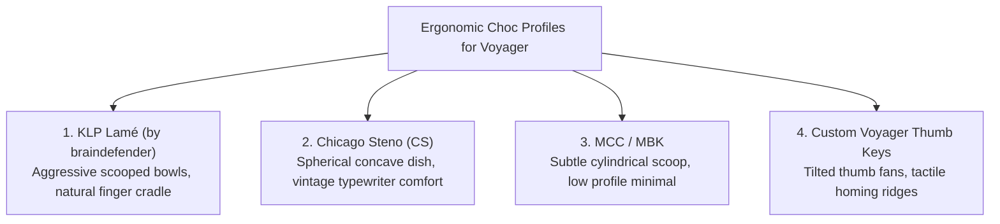
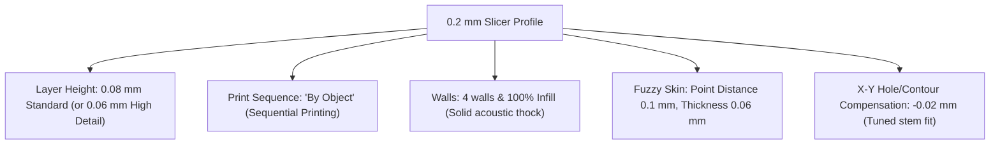

# ⌨️ Precision Printing & ZSA Voyager Keycaps (0.2mm Nozzle)

The **ZSA Voyager** is one of the most advanced split, low-profile ergonomic mechanical keyboards in the world. Printing custom keycaps for it is an extraordinarily rewarding project, but Kailh Choc v1 switches feature ultra-compact stem tolerances that demand specialized printing techniques and a **0.2 mm Hardened Steel Nozzle**.

---

## 🔬 The Anatomy of Kailh Choc v1 Switches

Unlike standard full-height Cherry MX switches (which feature a single central cross stem), the **Kailh Low Profile Choc v1** switches used on the ZSA Voyager use a **twin-prong mounting system**:

```
        CHOC KEYCAP STEM UNDERSIDE
        +-------------------------+
        |                         |
        |    [||]         [||]    |  <-- Two tiny rectangular prongs
        |    prong        prong   |      (~1.2mm x 3.0mm x 0.55mm)
        |                         |
        +-------------------------+
             |<- 5.70 mm ->|
               Center-to-Center
```

### Why a Standard 0.4 mm Nozzle Fails on Choc Keycaps:
* **Prong Wall Thickness:** Each Choc stem prong is only **$0.55\text{ mm}$ thick**.
* **The 0.4mm Nozzle Limitation:** A 0.4 mm nozzle extrudes a line width of $0.42\text{ mm}$. This means the slicer can only fit a single line of plastic into the prong. Single-perimeter prongs have poor layer cohesion and will **snap off flush inside your expensive keyboard switch** the second you try to remove or tilt the cap!
* **The 0.2mm Nozzle Solution:** A 0.2 mm nozzle extrudes lines as fine as **$0.20\text{ mm}$**. This allows the slicer to lay down **two full concentric perimeters plus internal fill** inside each prong, producing resilient, springy, unbreakable stems.

---

## 📐 Ergonomic Choc Profiles for the ZSA Voyager

Rather than flat, generic keycaps, the 3D printing community has developed contoured ergonomic profiles designed specifically for low-profile split boards:



### 1. KLP Lamé (Recommended)
* **Design:** Created specifically for low-profile split ergo keyboards (Corne, Voyager). Features an organic, deeply scooped dish that hugs your finger pads and reduces typing fatigue during long coding sessions.
* **Source:** Open-source on [GitHub: braindefender/KLP-Lame-Keycaps](https://github.com/braindefender/KLP-Lame-Keycaps) and MakerWorld.

### 2. Chicago Steno (CS)
* **Design:** Inspired by classic spherical sculpted keycaps (SA/MT3) but adapted for low-profile Choc spacing. Great for typists who prefer a distinct, deep center well.

### 3. Tactile Homing Keys (F & J / Home Row)
* 3D printing allows you to add pronounced tactile homing dots, horizontal ridges, or deeper dish angles to your home-row index finger keys (F and J, or your Colemak/Dvorak equivalents) for effortless touch typing.

---

## ⚖️ Print Orientation: Stem Strength vs. Surface Texture

The single most critical slicer decision when printing keycaps is the **build plate orientation**:

```
OPTION A: VERTICAL / STANDING UP               OPTION B: FACE-DOWN FLAT ON PLATE
(Maximum Stem Durability)                      (Glassy Smooth Top / Two-Color Legends)

             Dish ⌒                                    +-----------------+  <-- Smooth Bed
          +----------+                                 |  Keycap Face    |      Contact
          |          |                                 +-----------------+
          |          |  <-- Perimeters wrap                 [||]     [||]   <-- Stems point up
          |          |      along stem tension              Prongs   Prongs     in Z-axis
          +--[||]----+
          Prongs on Bed (with Tree Supports)
```

| Strategy | Print Orientation | Pros | Cons | Best For |
| :--- | :--- | :--- | :--- | :--- |
| **Option A: Vertical (Standing)** | Upright ($90^\circ$) or Angled ($45^\circ$) | **Unbreakable stems.** Continuous layer strands run the full length of the prongs; zero risk of stem shearing. | Requires fine Tree supports under the cap overhang. | Daily driving, aggressive switch pullers, textured caps. |
| **Option B: Face-Down (Flat)** | Top surface flat on smooth PEI | **Flawless, glassy top surface.** Enables crisp, flush **dual-color legends** on the first layer. | Stems print in Z-direction (delamination risk if pulled sideways). | Art/accent keycaps, custom numbered legends. |

---

## 🎨 Dual-Nozzle Legends on the Bambu X2D

The **Bambu X2D** is uniquely equipped for keycaps because of its dual independent extruders:

1. **Flush Dual-Color Legends (No Purge Waste):**
   * **Extruder 1 (Main):** Body color (e.g., Matte Black PETG).
   * **Extruder 2 (Auxiliary):** Legend color (e.g., Crisp White, Neon Cyan, or Bright Orange PETG).
   * By printing face-down, the text or iconography is extruded directly onto the build plate on Layer 1, and the body filament seamlessly fuses around it on the exact same layer. The result is a **100% flush, two-color keycap with zero height ridges** that will never wear off like printed ink!

---

## ⚙️ Golden Slicer Settings for 0.2 mm Nozzle Keycaps

Configure these parameters in Bambu Studio / OrcaSlicer when switching to your 0.2 mm hotend:



### 1. Print Sequence: "By Object" (Sequential Printing)
* **The Problem:** When printing 20 keycaps simultaneously in standard "By Layer" mode, the nozzle travels back and forth between every cap on every single layer, causing microscopic stringing, oozing, and travel zits across the delicate stems.
* **The Fix:** In Bambu Studio under `Global Settings -> Others -> Print Sequence`, change from *By Layer* to **By Object**. The printer will print each keycap completely from bottom to top before moving to the next!

### 2. The "Fuzzy Skin" PBT Texture Secret
* Commercial keycaps use textured PBT plastic to prevent fingertip slip and resist skin oil shine.
* In Bambu Studio, enable:
  * **Fuzzy Skin:** `Contour only`
  * **Fuzzy Skin Thickness:** `0.05 mm – 0.08 mm`
  * **Fuzzy Skin Point Distance:** `0.10 mm`
* This creates a micro-textured matte surface that completely conceals layer lines and feels identical to high-end mechanical keycaps!

### 3. Solid Density for Acoustic "Thock"
* Keycaps should not be hollow. Set **Wall Loops to 4** and **Infill to 100%**. Solid plastic keycaps dampen high-pitched switch clicks and produce a deep, premium acoustic bottom-out sound.

### 4. Tuning Stem Tolerances
* Because every filament shrinks slightly differently, print a single test keycap first:
  * *If the stem is too tight to insert:* Adjust `Quality -> Precision -> X-Y Contour Compensation` to **`-0.02 mm`** or **`-0.04 mm`**.
  * *If the stem is loose / falls off:* Adjust `X-Y Contour Compensation` to **`+0.02 mm`**.

---

## 🧪 Material Selection for Keycaps

| Filament | Legend Sharpness | Stem Durability | Feel / Acoustic Profile | Recommendation |
| :--- | :--- | :--- | :--- | :--- |
| **PETG / PETG-HF** | ⭐⭐⭐⭐ | **⭐⭐⭐⭐⭐ (Highest)** | Smooth, semi-flexible, deep sound | **Best overall.** The slight flex of PETG prevents the prongs from snapping during repeated installation. |
| **PLA+ / Tough PLA** | **⭐⭐⭐⭐⭐ (Crispest)**| ⭐⭐⭐ (Can be brittle)| Crisp, loud, rigid | Great for rapid prototyping and fine icon legends. |
| **ASA** | ⭐⭐⭐⭐ | ⭐⭐⭐⭐ | Matte, textured, zero oil shine | Fantastic for long-term daily typing; can be acetone vapor smoothed. |

---

## 🛠️ Step-by-Step: Printing Your First Voyager Keycap

1. **Hardware Swap:** Power down the X2D and swap to the **0.2 mm Hardened Steel Nozzle**. Select the 0.2mm nozzle on the printer touchscreen to update auto-leveling algorithms.
2. **Clean Plate:** Degrease your Textured or Smooth PEI sheet with warm water and Dawn dish soap.
3. **Calibrate:** Run a flow dynamics (K-Factor) auto-calibration for the 0.2mm nozzle.
4. **Print Stem Test:** Slice a single 1U keycap (see [[Keycaps - ZSA Voyager Ergonomic Choc Set]]). Test fit onto an uninstalled switch or a corner key on your Voyager.
5. **Batch Production:** Once stem tolerances are dialed in, arrange a row of 6–10 caps set to **Print by Object**.

---

**Related Projects:** [[Keycaps - ZSA Voyager Ergonomic Choc Set]] | [[01a - Bambu X2D Buyer's Guide & Purchase Checklist]] | [[08 - Print Queue & Project Tracker]]
