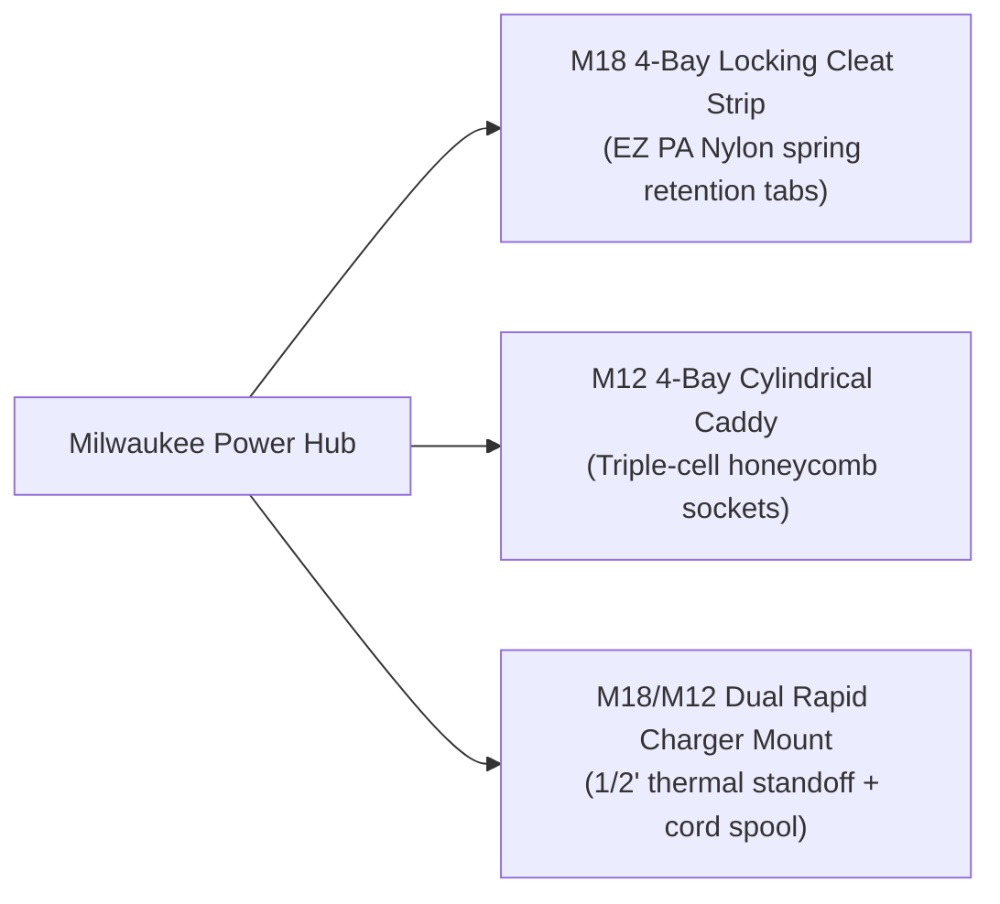

# 🔴 Project: Milwaukee M18 & M12 Tool & Battery Storage

Custom-engineered heavy-duty storage brackets for the **Milwaukee FUEL M18 & M12 cordless tool lineup**, designed to lock directly onto a **3/4" Birch French Cleat wall system** using **Bambu ASA** and **EZ PA (Nylon)** printed on the **Bambu X2D**.

---

## 🧰 Milwaukee Tool Hanger Specifications

```
         M18 DRILL DOCK                     M18 ANGLE GRINDER CRADLE
     [French Cleat Bracket]                 [French Cleat Bracket]
              │                                      │
       +──────────────+                       +──────────────+
       │ Slide Rail   │                       │  U-Yoke Neck │  <-- Supports metal
       │   Channels   │                       │    Collar    │      gearhead; clears
       +──────────────+                       +──────────────+      guard & handle!
              │                                      │
     [Inverted M18 Drill]                   [Vertical Hanging Grinder]
```

### 1. M18 FUEL Hammer Drill & Impact Driver Set
* **Tool Profile:** Heavy nose-down tools with high-output battery packs (XC 5.0 / HO 6.0 / 8.0Ah).
* **Mounting Style:** **Dual French Cleat Slide-In Dock**.
  * The tool's molded battery shoe slides into parallel channel rails on the underside of the bracket.
  * The tool hangs upside down, completely counterbalancing the heavy metal chuck.
  * Features an integrated side holster loop to hold spare 2" driver bits and magnetic bit holders.
* *Slicer Config:* **ASA**, 5 walls, 35% Gyroid infill. Print with `Support for ABS` in the auxiliary nozzle for glass-smooth internal slide rails.

### 2. M12 Circular Saw (5-3/8" or 5-1/2")
* **Tool Profile:** Wide cast/stamped aluminum shoe with 0°–50° bevel bracket.
* **Mounting Style:** **Baseplate Shoe Slot Cleat Caddy**.
  * The saw's flat metal shoe slides into a retention groove on the cleat bracket.
  * The blade and lower guard hang enclosed and recessed inward, preventing accidental contact or dulled carbide teeth.
  * Rear retention lip ensures the saw cannot slide forward off the cleat during garage vibrations.
* *Slicer Config:* **ASA**, 5 walls, 30% Gyroid infill.

### 3. M18 Angle Grinder (4-1/2" / 5")
* **Challenge:** Heavy cast-aluminum gearbox head, protruding steel wheel guard, and side auxiliary handle make standard hooks impossible.
* **Mounting Style:** **Spindle Neck U-Yoke Collar**.
  * A contoured U-shaped collar supports the tool's neck directly behind the spindle locking flange.
  * The opening is sized to allow the grinder to drop in with both the **wheel guard** and **side handle installed** at 90°.
  * Extra clearance notch accommodates the spanner wrench holder.
* *Slicer Config:* **PC-ABS** or **ASA**, 6 walls, 40% Gyroid infill (high static torque load).

### 4. M18 FUEL Sawzall (Reciprocating Saw)
* **Tool Profile:** Long, front-heavy horizontal tool (~18" length).
* **Mounting Style:** **Two-Piece Horizontal Cleat Cradle**.
  * **Front Bracket:** Contoured rubber nose boot cradle with a deep lip.
  * **Rear Bracket:** Open D-handle resting saddle.
  * Suspends the Sawzall horizontally across two cleat positions, keeping the blade flat and safe against the wall.
* *Slicer Config:* **ASA**, 5 walls, 30% Gyroid infill.

---

## 🔋 Battery Storage & Rapid Charger Brackets



### 1. M18 4-Bay Battery Locking Cleat Strip
* **Capacity:** Holds four M18 batteries (fits all sizes: CP 2.0 up to High Output 12.0Ah).
* **Retention Mechanism:** Uses **EZ PA (Nylon)** locking tabs that catch the battery's dual side push-clips with an audible, satisfying *click*. Pressing the red battery release buttons allows smooth one-handed extraction.
* **Wall Angle:** Mounted at a $15^\circ$ upward tilt on the French cleat to prevent gravity creep.

### 2. M12 4-Bay Cylindrical Honeycomb Caddy
* **Capacity:** Holds four M12 batteries (CP 1.5/2.0/3.0 or XC 4.0/6.0).
* **Design:** Deep cylindrical sockets that protect the exposed copper terminal contacts from metallic shop dust and metal shavings.

### 3. M18 & M12 Dual Rapid Charger Wall Cleat
* **Thermal Management:** Fast chargers generate significant heat during high-amp charging cycles.
* **Design Features:**
  * **1/2" Air Standoff:** Holds the charger away from the wall to allow convective airflow through the bottom cooling slots.
  * **Integrated Cord Spool:** Wraps excess 6-foot heavy power cord neatly behind the unit.
  * **Snap-Keyhole Anchors:** Matches the factory rear mounting keyholes on the underside of the charger.

---

## ⚙️ Golden Slicer Profile for Heavy Garage Mounts (X2D)

| Parameter | Slicer Setting | Rationale |
| :--- | :--- | :--- |
| **Material (Main Nozzle)** | **Bambu ASA (Black or Red)** | Resists 50°C+ garage heat, UV sunlight, and oils |
| **Material (Aux Nozzle)** | **Support for ABS** | Zero-gap breakaway for clean slide tracks |
| **Nozzle Size** | 0.4 mm or 0.6 mm Hardened Steel | 0.6mm recommended for faster 5-wall prints |
| **Layer Height** | `0.20 mm Standard` or `0.28 mm Draft`| 0.28mm provides excellent layer adhesion and speed |
| **Walls / Perimeters** | **5 to 6 walls** | Prevents flex under heavy 8 lb tools |
| **Infill** | **35% Gyroid** | Multi-directional structural shear strength |
| **Top / Bottom Layers** | 5 top / 5 bottom | Rigid bolt anchor surfaces |
| **Chamber Preheat** | **60°C (15 minutes)** | Eliminates warping on large flat brackets |
| **Build Plate** | Smooth PEI + Glue Stick | Glue provides adhesion and clean release |

---

## 📋 Production Queue & Checklist

- [ ] **Print 1:** M18 Drill & Impact Driver Dual French Cleat Slide Dock.
- [ ] **Print 2:** M18 4-Bay Battery Locking Cleat Strip (Test EZ PA Nylon tabs).
- [ ] **Print 3:** M12 4-Bay Honeycomb Battery Caddy.
- [ ] **Print 4:** M18 Angle Grinder Spindle Neck Collar.
- [ ] **Print 5:** M12 Circular Saw Baseplate Shoe Slot Bracket.
- [ ] **Print 6:** M18 FUEL Sawzall Two-Piece Horizontal Cradle.
- [ ] **Print 7:** M18/M12 Rapid Charger Cleat Mount with Thermal Air Gap.

---

**Parent Guides:** [[Garage - Modular French Cleat Tool System]] | [[04 - Phase 2 - Garage & Workshop Tool Organization]] | [[08 - Print Queue & Project Tracker]]
