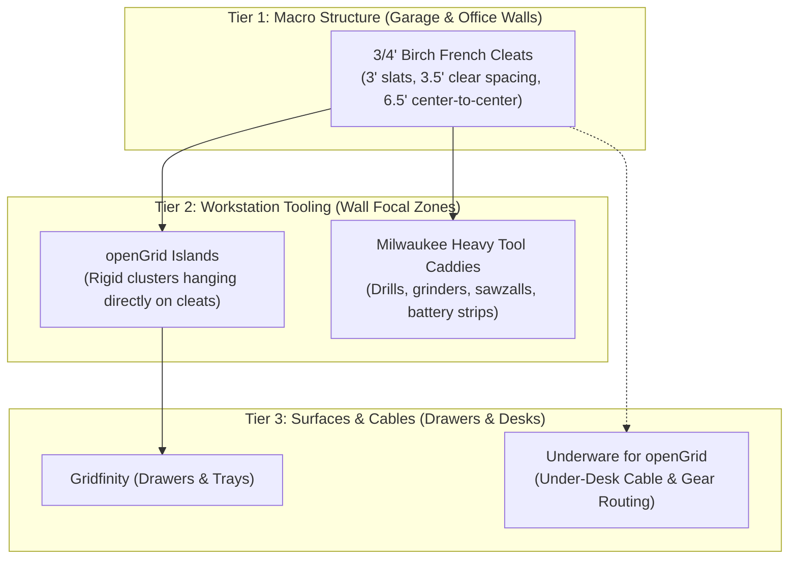

# 🪵 Project: Universal French Cleat & openGrid Island Infrastructure

A unified room-scale storage architecture combining **3/4" Baltic Birch plywood wall rails** with **3D-printed tool caddies, openGrid islands, and locking tabs** printed on the **Bambu X2D**. Standardized with identical dimensions across **both the Garage and Office**.

---

## 🏛️ The Three-Tier Architectural Hierarchy



---

## 📐 The 4x8 Birch Plywood Cut Plan & Yield Calculation

To maximize linear feet and eliminate waste from a single $48" \times 96"$ ($4\text{ ft} \times 8\text{ ft}$) sheet of 3/4" Birch plywood:

```
+-----------------------------------------------------------------------------+
|                                96" (8 Feet)                                 |
+-----------------------------------------------------------------------------+
| Strip 1 (5.85" wide) ─────────► [Table Saw 45° Center Rip] ──► Cleat 1A & 1B|
| Strip 2 (5.85" wide) ─────────► [Table Saw 45° Center Rip] ──► Cleat 2A & 2B|
| Strip 3 (5.85" wide) ─────────► [Table Saw 45° Center Rip] ──► Cleat 3A & 3B|
| Strip 4 (5.85" wide) ─────────► [Table Saw 45° Center Rip] ──► Cleat 4A & 4B|
| Strip 5 (5.85" wide) ─────────► [Table Saw 45° Center Rip] ──► Cleat 5A & 5B|
| Strip 6 (5.85" wide) ─────────► [Table Saw 45° Center Rip] ──► Cleat 6A & 6B|
| Strip 7 (5.85" wide) ─────────► [Table Saw 45° Center Rip] ──► Cleat 7A & 7B|
| Strip 8 (5.85" wide) ─────────► [Table Saw 45° Center Rip] ──► Cleat 8A & 8B|
+-----------------------------------------------------------------------------+
```

### Table Saw Cutting Sequence (Single Setup for Office & Garage)
1. **Rip 8 Parallel Strips (90° blade):**
   * Set fence to **$5.85"$**.
   * Rip the 48" width into eight 8-foot long strips ($8 \times 5.85" + 7 \times 0.125"\text{ kerfs} \approx 47.7"$).
2. **Center 45° Bevel Cut (45° tilted blade):**
   * Tilt the table saw arbor to **$45.0^\circ$**.
   * Set fence to approximately **$2.55"$** (measured to the short point of the bevel) so the blade cuts directly down the geometric center of each 5.85" strip.
   * Run each of the 8 strips through.
3. **Total Yield:**
   * **16 individual 8-foot French cleats** = **$\mathbf{128\text{ linear feet}}$** of wall rails!
   * Cleat height: **$\sim 2.85" \text{ to } 2.92"$ tall** (nominally 3").
   * Yield split: e.g., 10 cleats for the garage (80 linear ft) + 6 cleats for the office (48 linear ft).

---

## 🔨 Wall Installation & The 3.5" "Story Stick" Workflow

With a **3.5" clear spacing between cleats**, total row-to-row spacing is:
$$\text{Row Height} = 2.9" \text{ (Cleat)} + 3.5" \text{ (Clear Space)} = \mathbf{6.4"\text{ Center-to-Center}}$$

* On a **4-foot tall wall section** ($48"$), this fits **$7\text{ to }8$ rows of cleats**.
* 16 cleats will cover **two full 8-foot wide by 4-foot tall wall sections** (a massive 16-foot wide workshop wall!).

### Step-by-Step Installation:
1. **Locate Studs:** Use a magnetic or digital stud finder to mark all 16" on-center wall studs across the wall.
2. **Level the Base Cleat:** Use a 4-foot spirit level or laser level to align the bottom row. Screw into each stud using **two #9 or #10 $\times 2-1/2"$ GRK R4 or Spax Cabinet Screws** (one 3/4" from the bottom, one 3/4" below the bevel).
3. **Cut the 3.5" Story Stick:** Cut a scrap piece of wood to exactly **$3.50"$ wide**.
4. **Stack & Fasten:** Rest the 3.5" spacer block on top of the mounted cleat, place the next cleat on top, verify level, and drive screws into studs. Repeat up the wall.

---

## 🖨️ 3D-Printed French Cleat Brackets & openGrid Islands

3D printing produces custom-fitted brackets that hook directly onto your 3/4" birch cleats with zero joinery:

```
             SIDE-PRINT ORIENTATION (Critical for Strength)
             
                  Build Plate (Textured PEI / Smooth Plate)
             ================================================
             |                                              |
             |   +--------------------------------------+   |
             |   | Layer lines run lengthwise around    |   |
             |   | the 45° wedge. Downward tool weight  |   |
             |   | pulls across extruded filament lines,|   |
             |   | NOT pulling layers apart!            |   |
             |   +--------------------------------------+   |
             ================================================
```

### 1. Dual-Cleat openGrid Island Frame (Office Focal Zone)
* **Function:** Mounts an openGrid tile cluster onto the French cleat wall.
* **Engineering:** Catches **two consecutive cleats (6-unit / $168\text{ mm}$ span matching the $6.5\"$ cleat row spacing)**. This vertical leverage completely prevents the bottom of the openGrid from swinging inward when plugging in USB cables or pressing Multiconnect accessories into the grid.
* **Material:** **PETG** (Office) or **ASA** (Garage). 4 walls, 20% Gyroid infill.

### 2. Single-Cleat Plumb Offset Spacer ($3/4"$ Standoff)
* **Function:** For small mini openGrid clusters hung from a single cleat.
* **Design:** A 3D-printed $3/4"$ thick block that snaps into the bottom corners of the openGrid tile to rest against the drywall, ensuring the panel hangs dead vertical.

### 3. Anti-Lift Safety Cam-Locks / Thumbscrew Wedges
* **The Problem:** In an office or shop, pulling tools, headphones, or cords upward can accidentally lift a caddy off the 45° cleat.
* **The Fix:** A rotating printed cam-lever or M4 thumbscrew wedge that tightens against the bottom 90° edge of the wall cleat, locking the caddy permanently until released.

### 4. Universal 45° Cleat Backplate (Heavy-Duty)
* **Function:** Standard 3/4" cleat receiver block with countersunk M4/M5 screw bosses. Screws into custom wooden boxes, shelves, or Milwaukee tool cradles.
* **Slicer Rules:** **ASA**, 5 walls, 35% Gyroid infill, **side-print orientation**.

---

## 📋 Production Checklist

- [ ] **Woodshop:** Rip 4x8 Birch sheet into 8 strips @ 5.85"; center split at 45° (16 cleats total).
- [ ] **Woodshop:** Cut 3.50" spacer block story stick.
- [ ] **Office Wall:** Mount 6 cleat rows behind desk with Spax screws.
- [ ] **Garage Wall:** Mount 10 cleat rows across tool wall with Spax screws.
- [ ] **3D Prints (Office):**
  - [ ] 2x Dual-cleat openGrid Island mounting brackets (6-unit / 168mm span).
  - [ ] 2x Anti-lift thumbscrew cam locks.
  - [ ] openGrid tile cluster with Multiconnect headphone hook & caliper cradle.
- [ ] **3D Prints (Garage):** Proceed to [[Garage - Milwaukee M18 & M12 Tool & Battery Storage]].

---

**Related Notes:** [[03 - Phase 1 - Desk Organization (Gridfinity & openGrid)]] | [[04 - Phase 2 - Garage & Workshop Tool Organization]] | [[Garage - Milwaukee M18 & M12 Tool & Battery Storage]] | [[08 - Print Queue & Project Tracker]]
