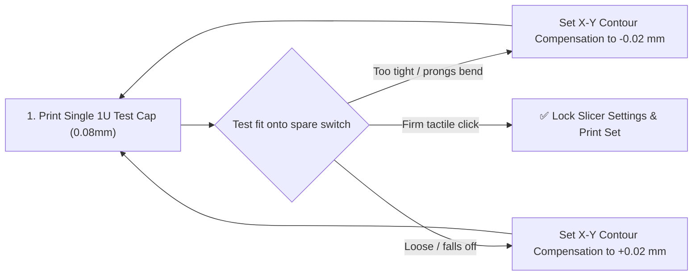

# ⌨️ Project: ZSA Voyager Ergonomic Choc Set

A complete custom ergonomic keycap set designed specifically for the 52-key split **ZSA Voyager**, featuring deeply contoured dished profiles (*KLP Lamé* / *Chicago Steno*), tactile homing markers, and durable dual-extruded Choc v1 stems.

---

## 📌 Project Overview
* **Keyboard Platform:** [ZSA Voyager](https://www.zsa.io/voyager) (52 Kailh Choc v1 low-profile switches).
* **Key Count Breakdown:**
  * **Alpha Cluster:** 20 keys Left half + 20 keys Right half (40x 1U keys).
  * **Inner Column Keys:** 4x 1U keys (2 per side).
  * **Thumb Cluster:** 8x 1U/1.5U ergonomic thumb keys (4 per side).
  * **Homing Keys:** 2x tactile dished/ridged keys (F and J or Colemak home keys).
* **Target Model Source:**
  * [GitHub: KLP-Lame-Keycaps by braindefender](https://github.com/braindefender/KLP-Lame-Keycaps)
  * [MakerWorld / Printables: Low-Profile Choc Ergonomic Sets](https://makerworld.com/en/search/models?keyword=choc+keycaps)

---

## ⚙️ Slicer Configuration (0.2 mm Hardened Steel Nozzle)

| Parameter | Recommended Setting | Rationale |
| :--- | :--- | :--- |
| **Nozzle** | **0.2 mm Hardened Steel** | Required to resolve 0.55mm stem prongs |
| **Layer Height** | **0.08 mm Standard Precision** | Near-invisible layer lines on finger scoop |
| **Line Width** | 0.20 mm | Allows 2 solid perimeters inside prongs |
| **Wall Loops** | 4 walls | Maximum stem resilience |
| **Infill** | 100% Solid | Produces deep, solid acoustic "thock" |
| **Print Sequence** | **By Object (Sequential)** | Zero travel oozing/stringing between caps |
| **Fuzzy Skin** | Contour only (`0.06mm / 0.10mm`) | Replicates injection-molded matte PBT feel |
| **Supports** | Tree (Organic) — Support Critical Only | For vertical orientation overhanging scoop |
| **Contour Compensation**| `-0.02 mm` (Tuned after test print)| Fine-tunes stem insertion friction |

---

## 🧪 Phase 1: Stem Tolerance Calibration Protocol

Before printing all 52 keys, print a single 1U test cap to dial in friction fit:

- [ ] Print single 1U blank cap standing vertically.
- [ ] Gently press onto a Kailh Choc switch. Verify:
  - Prongs slide smoothly into switch slots without excessive force.
  - Cap does not wobble or tilt loosely.
  - Pulling cap off does not strain or bend the prongs.

---

## 📋 Phase 2: Production Batches (52 Keys Total)

Arrange prints on the bed with clearance between objects to allow the toolhead to print sequentially:

### Batch 1: Home Row & Homing Keys (10 Keys)
- [ ] Left Home Row (A, S, D, F with tactile bar)
- [ ] Right Home Row (J with tactile bar, K, L, ;)
- [ ] 2x Inner Index column keys

### Batch 2: Top Row Alphas (12 Keys)
- [ ] Left Q, W, E, R, T + Number
- [ ] Right Y, U, I, O, P + Symbol

### Batch 3: Bottom Row Alphas (12 Keys)
- [ ] Left Z, X, C, V, B + Mod
- [ ] Right N, M, ,, ., / + Mod

### Batch 4: Thumb Clusters & Accents (8 Keys)
- [ ] Left Thumb Cluster (Space, Enter, Layer, Alt)
- [ ] Right Thumb Cluster (Backspace, Delete, Layer, Shift)

---

## 💡 Notes & Post-Processing
* **Switch Pulling Caution:** Always use a proper wire keycap puller. Pull straight upward; never rock the keycap forcefully side-to-side, as low-profile stems are more delicate than full-height MX stems.
* **Cleaning Supports:** Use fine precision tweezers to remove any tiny tree support tree branches under the scoop.

---

**Parent Index:** [[10 - Precision Printing & ZSA Voyager Keycaps (0.2mm Nozzle)]] | [[08 - Print Queue & Project Tracker]]
